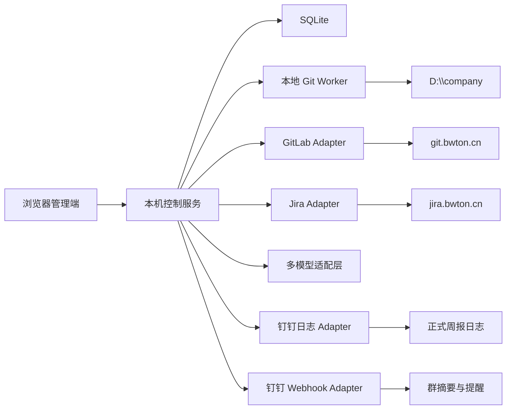

# 多项目研发、周报与绩效管理系统设计方案 v1.2

## 1. 设计结论

### 1.1 已确认的企业环境

- 本地项目根目录：`D:\company`
- 当前 Git 仓库：14 个
- 代码托管平台：公司自建 GitLab
- GitLab 地址：`https://git.bwton.cn`
- Jira 地址：`https://jira.bwton.cn`
- Jira REST API：支持 `/rest/api/2/*`，需要授权
- 任务来源：Jira API 为主、Excel 导入为兜底
- 周报载体：钉钉日志模板 `uTwin产研创新部周报`
- 钉钉群：存在官方机器人“AI小钉”
- 群内允许添加：GitLab、JIRA、自定义 Webhook 等机器人
- 部署方式：Windows 本机 Web 服务
- AI：使用外部模型供应商，本地不部署模型
- AI 数据范围：默认只发送任务、Commit 等元数据
- Git 写操作：预检后由用户确认
- 首版不允许 AI 自动修改源代码

### 1.2 系统目标

统一完成：

- GitLab 项目和本地仓库管理。
- 跨仓库分支、提交、拉取和推送。
- Jira 任务自动同步。
- Excel 任务表导入。
- Jira 任务与 Git 分支、Commit 关联。
- 生成钉钉六字段周报。
- 正式写入钉钉日志。
- 通过自定义机器人发送摘要和提醒。
- 季度成果汇总、筛选和绩效自评生成。
- Excel、Word 绩效材料导出。

---

## 2. 总体架构



### 2.1 技术选型

- 前端：React、TypeScript、Vite、Ant Design
- 后端：Node.js、TypeScript、NestJS、Fastify
- 数据库：SQLite WAL
- ORM：Prisma
- Git：本机 `git.exe`
- Excel：SheetJS 或同类 Node.js 库
- 模型接口：
  - OpenAI-compatible
  - Anthropic
  - Gemini
- 密钥存储：Windows DPAPI 或 Credential Manager
- 默认地址：`http://127.0.0.1:3760`
- 默认只绑定 `127.0.0.1`

### 2.2 进程划分

1. Web 控制服务  
   负责页面、数据库、任务同步、报告生成和外部 API。

2. Git Worker  
   以当前 Windows 用户身份运行，使用现有 Git 凭证，只访问仓库白名单。

3. 后台调度器  
   负责 Jira 增量同步、Git 元数据更新、周报提醒和备份。

---

## 3. 核心功能设计

### 3.1 项目与仓库中心

展示：

- 项目名称和本地路径。
- GitLab 项目地址。
- 当前分支。
- 默认分支。
- 工作区修改数量。
- 未推送提交。
- 与远程分支领先/落后数量。
- 最近提交。
- Pipeline 状态。
- Merge Request 状态。
- 对应 Jira 父任务和子任务。

项目发现流程：

1. 扫描 `D:\company` 一级目录。
2. 识别 `.git`。
3. 读取远程地址。
4. 将 GitLab URL 解析为 namespace 和 project path。
5. 匹配 GitLab API 项目。
6. 用户确认项目显示名称和别名。
7. 配置默认基线分支。
8. 记录 Git 作者姓名和邮箱别名。

### 3.2 GitLab 集成

GitLab API 用于：

- 项目基本信息。
- 远程分支。
- Commit。
- Merge Request。
- Pipeline。
- Tag 和 Release。
- 项目成员只读信息。

首版接口：

```text
GET /api/v4/user
GET /api/v4/projects/:id
GET /api/v4/projects/:id/repository/branches
GET /api/v4/projects/:id/repository/commits
GET /api/v4/projects/:id/merge_requests
GET /api/v4/projects/:id/pipelines
```

本地 Git CLI 继续负责：

- 工作区状态。
- 本地分支。
- Fetch。
- Pull。
- Checkout。
- Commit。
- Push。
- Stash。

即使没有 GitLab API Token，本地仓库管理仍可使用。

### 3.3 批量 Git 操作

允许批量执行：

- `fetch --prune`
- `pull --ff-only`
- 从指定基线创建分支
- 切换分支
- 首次推送并设置 upstream
- 普通 Push
- Stash 创建和应用
- 对已有修改执行 Stage 和 Commit

禁止：

- `push --force`
- `reset --hard`
- 未确认自动 Commit
- 自动解决冲突
- 批量 Merge/Rebase
- 自动删除未合并分支
- 任意 Shell 命令

执行流程：

```text
选择操作
→ 选择仓库
→ 预检
→ 展示影响和命令
→ 用户确认
→ 逐仓库执行
→ 保存结果
```

每个操作保存预检时的 HEAD。如果执行时 HEAD 已变化，必须重新预检。

---

## 4. Jira 任务同步

### 4.1 授权

使用 Jira Personal Access Token 或公司允许的 API 授权方式。

安全要求：

- Token 只在本机设置页填写。
- 不允许通过聊天、日志、URL 参数或截图传递。
- 数据库只保存加密后的凭证引用。
- 页面只显示掩码。
- 提供“测试连接”和“立即撤销本地配置”。
- 不保存 Jira 登录密码。
- 不使用网页登录自动化。

### 4.2 首次连接

依次调用：

```text
GET /rest/api/2/myself
GET /rest/api/2/field
GET /rest/api/2/project
GET /rest/api/2/search
```

首次连接完成：

- 确认当前 Jira 用户。
- 获取标准字段和自定义字段。
- 配置任务开始日期字段。
- 配置迭代/Sprint 字段。
- 配置父子任务关系。
- 配置工时字段。
- 保存字段映射版本。

### 4.3 任务查询

默认 JQL：

```text
assignee = currentUser()
ORDER BY updated DESC
```

周报同步：

```text
assignee = currentUser()
AND updated >= startOfWeek()
ORDER BY project, updated
```

季度同步：

```text
assignee = currentUser()
AND updated >= "季度开始日期"
AND updated <= "季度结束日期"
ORDER BY project, updated
```

增量同步以 Jira 的 `updated` 字段为游标。

### 4.4 Jira 字段模型

```ts
interface JiraTask {
  issueKey: string;
  projectKey: string;
  issueType: string;
  parentIssueKey?: string;
  parentTitle?: string;
  title: string;
  description?: string;
  assigneeAccountId?: string;
  assigneeName?: string;
  statusId: string;
  statusName: string;
  priority?: string;
  plannedStartDate?: string;
  dueDate?: string;
  originalEstimateSeconds?: number;
  remainingEstimateSeconds?: number;
  timeSpentSeconds?: number;
  sprintIds: string[];
  labels: string[];
  components: string[];
  updatedAt: string;
}
```

Jira 状态统一映射：

```text
待处理 → planned
进行中 → in_progress
已完成/已关闭 → done
受阻 → blocked
取消 → cancelled
其他 → 保留原状态并由用户映射
```

### 4.5 Excel 兜底导入

继续支持现有三类工作表：

- 后端开发jira
- 前端开发jira
- 系统测试jira

后端任务表包含父任务、子任务、经办人、计划日期、工时和人日公式。:codex-file-citation{path="C:/Users/WIN11/Downloads/P_Manager_20260129_HQ_【gis功能】.xlsx" artifact_kind="workbook" sheet="后端开发jira" range="A1:H11"}

前端任务表使用相同结构，但包含较多未排期任务。:codex-file-citation{path="C:/Users/WIN11/Downloads/P_Manager_20260129_HQ_【gis功能】.xlsx" artifact_kind="workbook" sheet="前端开发jira" range="A1:H15"}

导入规则：

- 空白父任务 ID、名称继承上一条。
- 父任务容器行不直接作为个人周报工作项。
- Excel 日期序列转换为真实日期。
- H 列为空标题但存在 `G/8` 公式时，识别为人日。
- 工时为空时保留为空，不转换成零。
- 不回写原始 Excel。
- Jira API 和 Excel 同时存在时，以 Jira issue key 去重。
- Jira 数据为主，Excel 仅补充排期或工时。

---

## 5. 任务与 Git 证据关联

关联优先级：

1. 分支名包含 Jira issue key。
2. Commit message 包含 issue key。
3. Merge Request 标题包含 issue key。
4. 项目、日期和关键词匹配。
5. AI 基于元数据给出建议。
6. 用户人工确认。

```ts
interface TaskEvidenceLink {
  taskId: string;
  sourceType: "commit" | "branch" | "merge_request" | "pipeline";
  sourceId: string;
  method: "issue_key" | "branch_name" | "keyword" | "ai_suggestion" | "manual";
  confidence: number;
  confirmed: boolean;
}
```

AI 不得自动改变 Jira 状态。

---

## 6. 周报设计

### 6.1 正式模板

模板名称：

```text
uTwin产研创新部周报
```

字段模型：

```ts
interface WeeklyReportDraft {
  reportDate: string;
  recentGoals: string;
  currentWeekWork: string;
  nextWeekPlan: string;
  assistanceAndProblems: string;
  otherNotes: string;
  attachments: ReportAttachment[];
  recipientUserIds: string[];
  recipientGroupIds: string[];
  recipientOnly: boolean;
  scheduledAt?: string;
}
```

### 6.2 字段生成规则

#### 周报填写日期

- 默认本周最后一个工作日。
- 可修改。
- 单独保存报告覆盖周期。

#### 近期工作目标

来源：

- 当前 Sprint。
- 未完成 Jira 父任务。
- 两周内计划任务。
- 用户手工目标。

按父任务或阶段目标汇总。

#### 本周工作内容

来源优先级：

1. 本周 Jira 状态变化。
2. 本周完成或推进的个人任务。
3. 已关联 Git Commit、MR 和 Pipeline。
4. 未关联 Git 提交。
5. 人工补充。

输出必须体现：

- 项目或父任务。
- 工作内容。
- 当前结果。
- 完成状态。
- 预计或实际工时。

不得逐条复制 Commit message。

#### 下周工作计划

来源：

- 下周开始或到期的 Jira 任务。
- 本周未完成任务。
- 当前 Sprint 剩余任务。
- 用户临时计划。

#### 需要协助或存在的问题

来源：

- Jira blocked 状态。
- 逾期任务。
- Pipeline 失败。
- Git 冲突。
- 跨团队依赖。
- 用户输入。

无问题时填写“暂无”。

#### 其他补充

包括：

- 技术调研。
- 会议和评审。
- 临时协作。
- AI 提效。
- 文档整理。
- 非 Jira 工作。

### 6.3 周报状态

```text
collecting
→ generated
→ editing
→ confirmed
→ log_submitting
→ log_submitted
→ robot_notified
```

异常状态：

```text
log_failed
robot_failed
partial_delivery
```

所有 AI 版本和人工修改均保留。

---

## 7. 钉钉集成

### 7.1 三种能力分工

#### AI小钉

用途：

- 群内官方智能能力。
- 智能周报辅助。
- 日历提醒。

系统不依赖 AI小钉执行外部 API 调用，因为目前没有确认其对第三方系统开放调用接口。

#### 钉钉日志接口

用于：

- 获取正式日志模板。
- 写入六个周报字段。
- 添加附件。
- 指定接收人和接收群。
- 提交正式周报。
- 查询提交结果。

这是正式周报的主通道。

#### Custom Webhook 机器人

用于：

- 周报已提交提醒。
- 周报摘要。
- 提交失败提醒。
- 周报填写截止提醒。
- 可选项目风险通知。

不替代正式日志。

### 7.2 自定义机器人安全

创建时选择“加签”模式。

保存：

- Webhook 地址。
- 签名 Secret。
- 群标识。
- 机器人名称。

要求：

- 使用 DPAPI 加密。
- 不进入日志。
- 不展示完整值。
- 不通过聊天传递。
- 支持测试消息。
- 支持禁用和重新生成。

钉钉官方提供自定义机器人创建、安全设置和 Webhook 获取流程：[自定义机器人接入](https://open.dingtalk.com/document/orgapp/custom-robot-access)。

### 7.3 GitLab 和 Jira 群机器人

首版不默认添加。

原因：

- 主要用于平台事件推送。
- 容易产生大量 Commit、Issue 更新消息。
- 不承担系统的任务同步或 Git 管理。
- 本系统已通过 API 获取相关数据。

后续可以按项目单独启用：

- 仅 Pipeline 失败。
- 仅 Merge Request 合并。
- 仅严重 Jira 阻塞任务。

### 7.4 提交流程

```text
系统生成周报
→ 用户修改
→ 用户确认
→ 写入钉钉正式日志
→ 获取日志ID
→ Custom机器人发送简短通知
```

机器人摘要不得包含完整周报，只发送：

- 周报日期。
- 提交状态。
- 主要项目名称。
- 正式日志链接或标识。

---

## 8. AI 模型层

```ts
interface AIProviderConfig {
  name: string;
  protocol: "openai_compatible" | "anthropic" | "gemini";
  baseUrl?: string;
  model: string;
  apiKeyRef: string;
  enabled: boolean;
  metadataOnly: boolean;
}
```

默认发送：

- Jira 标题、状态和工时。
- Git Commit message。
- 分支名。
- MR 标题。
- 项目名称。
- 用户手工补充。

默认不发送：

- 源代码。
- 完整 Git diff。
- 环境变量。
- 配置文件。
- GitLab/Jira/DingTalk Token。
- Webhook。
- 客户数据和附件内容。

模型只负责：

- 聚合。
- 去重。
- 分类。
- 周报表述。
- 成果总结。
- 绩效建议。

模型不能：

- 执行 Git。
- 修改 Jira。
- 提交钉钉。
- 自动修改代码。
- 自动决定绩效分数。

---

## 9. 季度绩效

季度成果池来源：

- Jira 完成任务。
- Jira 工时。
- Git Commit。
- Merge Request。
- Pipeline 和发布记录。
- 已确认周报。
- 手工补充。

处理流程：

1. 选择季度。
2. 同步 Jira 和 Git。
3. 汇总周报。
4. 按项目和成果聚类。
5. 去重。
6. 展示成果候选池。
7. 用户勾选。
8. 映射考核指标。
9. 生成自评文字。
10. 生成分数建议。
11. 用户调整分数。
12. 使用公式计算总分。
13. 导出 Excel 和 Word。

要求：

- 每项成果保留证据链接。
- 各项分数允许不同。
- 不以 Commit 数量直接计算绩效。
- 不以代码行数计算工时。
- AI 分数仅供参考。
- 最终材料不自动提交给公司。

---

## 10. 主要接口

```text
POST /api/projects/discover
GET  /api/projects
POST /api/repositories/:id/sync

POST /api/git/batches/preview
POST /api/git/batches/:id/approve
GET  /api/git/batches/:id

POST /api/integrations/gitlab/test
POST /api/integrations/jira/test
POST /api/integrations/jira/sync

POST /api/task-imports/preview
POST /api/task-imports/:id/commit
GET  /api/tasks

POST /api/weekly-reports/generate
PUT  /api/weekly-reports/:id
POST /api/weekly-reports/:id/confirm
POST /api/weekly-reports/:id/submit-log
POST /api/weekly-reports/:id/notify-group

POST /api/quarterly-reviews/collect
PUT  /api/quarterly-reviews/:id/achievements
POST /api/quarterly-reviews/:id/generate
POST /api/quarterly-reviews/:id/export
```

---

## 11. 测试与验收

### 集成测试

- GitLab Token 成功、失效和权限不足。
- Jira Token 成功、失效和权限不足。
- Jira 字段发现。
- Jira 增量同步。
- Excel 与 Jira 去重。
- Git 分支与 Jira issue key 关联。
- 钉钉日志模板读取。
- 正式周报提交。
- Custom 机器人签名。
- 重复点击提交的幂等保护。

### 关键验收标准

- 正确管理现有 14 个仓库。
- 可从 Jira 自动同步个人任务。
- Jira 不可用时可导入现有 Excel。
- Excel 空白父任务可以正确继承。
- 周报严格生成六个字段。
- 周报可追溯到 Jira 或 Git 证据。
- 提交前可以人工修改。
- 正式日志和机器人消息职责分离。
- 所有写操作均需确认。
- Token 和 Webhook 不以明文保存。
- 绩效成果可人工筛选。
- 绩效分数不同但总分公式准确。

---

## 12. 实施顺序

### 阶段一：基础和安全

- 本机 Web 服务。
- SQLite。
- 本地密钥保险箱。
- 用户身份和 Git/Jira 别名。
- 审计日志。

### 阶段二：GitLab 与 Git

- 扫描 14 个仓库。
- GitLab 项目匹配。
- Git 状态和提交。
- 批量分支操作。
- MR 和 Pipeline 读取。

### 阶段三：Jira 与 Excel

- Jira REST API。
- 字段映射。
- 个人任务同步。
- 增量同步。
- 当前 Excel 模板导入。
- Jira 和 Excel 去重。

### 阶段四：周报和 AI

- 六字段周报。
- Jira/Git 证据整理。
- 多模型供应商。
- 人工编辑和版本管理。

### 阶段五：钉钉

- 日志模板读取。
- 正式日志提交。
- 自定义机器人。
- 加签和幂等控制。
- 降级复制。

### 阶段六：季度绩效

- 成果池。
- 筛选。
- 自评生成。
- 分数计算。
- Excel/Word 导出。

---

## 13. 默认决策

- Jira API 为主要任务来源。
- Excel 是兜底和补充来源。
- GitLab API 与本地 Git 同时使用。
- 正式周报通过钉钉日志提交。
- Custom 机器人只发送摘要和提醒。
- 暂不依赖 AI小钉的外部调用能力。
- 暂不添加 GitLab/JIRA 群机器人。
- 自定义机器人使用加签安全模式。
- 所有密钥仅在本机设置页填写。
- 经办人身份首次同步时确认，不写死姓名。
- 每天按 8 小时换算人日。
- 周报提交和 Git 写操作都必须人工确认。
- AI 默认只接触元数据，不读取源代码。
