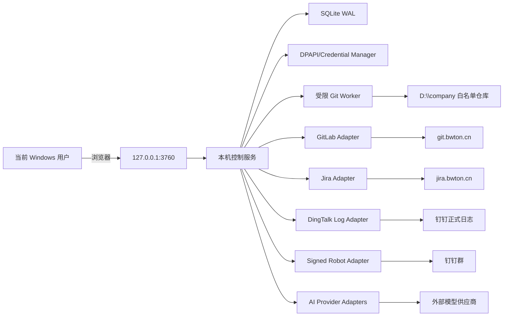
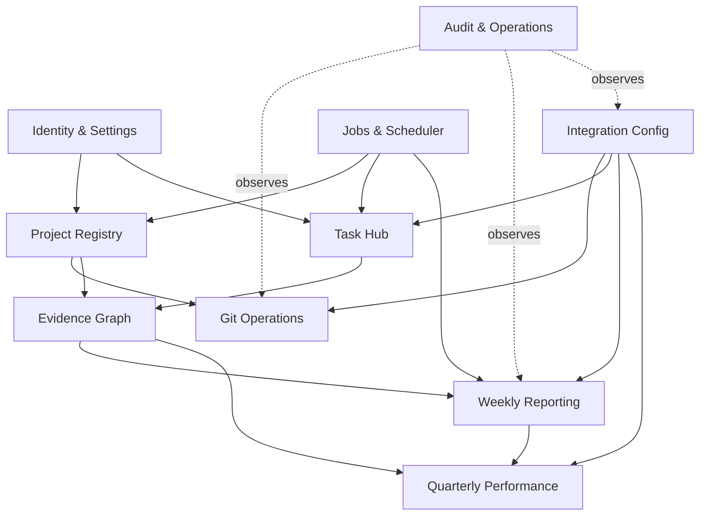
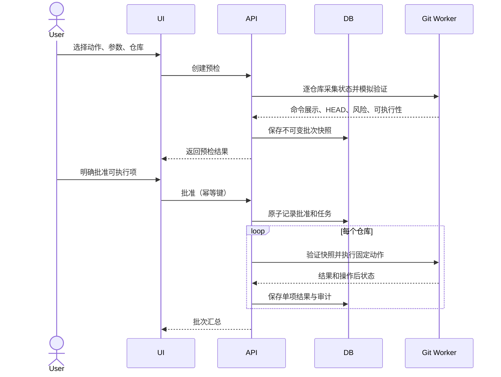

# 02 系统架构

## 1. 架构目标

架构必须同时满足四个互相制约的目标：本机仓库访问需要当前 Windows 用户身份；外部平台访问需要安全凭证；自动同步不能越权执行业务写操作；跨 GitLab、Jira、钉钉和 AI 的失败必须被隔离并可恢复。因此采用“单机模块化服务 + 受限 Git Worker + 持久化任务调度器 + 端口适配器”的结构，而不是把所有能力堆入页面进程。

## 2. 系统上下文



## 3. 逻辑分层

| 层 | 组件 | 责任 | 禁止 |
|---|---|---|---|
| 表现层 | React SPA | 展示、表单、轮询/事件更新、确认交互 | 直接持有 Token、直接调用本地 Git |
| 接口层 | NestJS Controllers | HTTP 协议、输入校验、幂等头、统一错误 | 写业务规则、拼自由 Shell |
| 应用层 | Use Cases / Orchestrators | 事务边界、状态机、权限、任务编排 | 依赖第三方响应的原始字段遍布代码 |
| 领域层 | Aggregates / Policies | 预检、确认、版本、证据、评分等规则 | 网络、文件系统和 UI 细节 |
| 端口层 | Git/Jira/GitLab/DingTalk/AI Ports | 稳定内部契约、能力矩阵 | 泄漏供应商密钥和非规范错误 |
| 适配层 | CLI/HTTP/File/Vault Adapters | 调用外部系统、转换和重试 | 将外部错误伪装成成功 |
| 基础设施 | SQLite、队列、调度、日志 | 持久化、锁、任务恢复、备份 | 存储明文凭证或敏感请求体 |

## 4. 可部署进程

### 4.1 Web 控制服务

- 托管静态前端和 `/api`。
- 管理数据库连接、业务事务、适配器和调度任务。
- 默认单实例；启动时获取实例租约，避免两个进程同时使用同一数据库和调度器。
- 只监听 IPv4/IPv6 loopback；明确配置并二次确认后才能改变，首版 UI 不提供远程绑定。
- 对所有变更请求校验 `Origin`、同源 CSRF 令牌和本机会话。

### 4.2 Git Worker

设计为受限子进程或独立本机进程，通过 stdin/stdout 的结构化消息或命名管道通信。每条请求包含 `requestId`、仓库 ID、规范化路径、动作枚举、结构化参数、超时和预检标识。

Worker 只实现固定动作：状态、分支/远端查询、fetch、ff-only pull、create branch、checkout、push、stash create/apply、stage paths、commit。它不接收命令字符串；命令行由动作内部模板生成，参数使用进程参数数组传递。

执行防线：

1. 按仓库 ID 从本地白名单解析路径，不信任请求自带路径。
2. 解析真实路径并验证仍在根目录下，拒绝目录链接逃逸。
3. 验证 `.git`、仓库 identity、允许的 remote 名称和动作参数。
4. 设定工作目录、非交互环境、超时、输出字节上限。
5. 分离 stdout/stderr，脱敏后保存摘要；原始输出仅在无密钥风险且有长度限制时保存。
6. 返回结构化退出码、领域错误和操作后状态，不返回新的 Shell 能力。

### 4.3 后台调度器

调度器与 Web 服务同进程部署，但任务和租约持久化，未来可独立拆分。任务分类：

| 类别 | 默认触发 | 可自动执行 | 并发 |
|---|---|---|---|
| Jira 增量同步 | 每 15 分钟、手动 | 是，只读 Jira + 本地 upsert | 单连接 1 |
| Git 本地状态刷新 | 每 5 分钟、页面请求 | 是，只读 | 全局 2、单仓库 1 |
| GitLab 元数据 | 每 10 分钟、手动 | 是，只读 | 单实例 2 |
| 周报数据收集 | 周四/周五或手动 | 是，仅生成草稿数据集 | 1 |
| 周报提醒 | 配置时刻 | 是，机器人通知须预先启用并有去重键 | 1 |
| 外部提交重试 | 人工触发或安全自动重试策略 | 只重试已批准的同一幂等动作 | 1 |
| 数据库备份 | 每日低峰 | 是 | 1 |

禁止调度器自动批准 Git 写、正式周报提交或最终绩效确认。

## 5. 模块边界



模块之间通过应用服务和内部 ID 交互，不直接读写对方表。Evidence Graph 只保存引用和快照摘要，不复制全部源对象。

## 6. 关键端到端流程

### 6.1 批量 Git 写操作



### 6.2 Jira 增量同步

1. 读取连接的最新成功复合水位。
2. 将查询起点向前重叠一个可配置窗口（默认 2 分钟）。
3. 使用 POST search、字段白名单、稳定排序 `updated ASC, key ASC` 分页读取。
4. 将响应先规范化到 staging 记录，保留来源摘要哈希和字段映射版本。
5. 在短事务内 upsert 任务、状态历史、Sprint、同步观测；相同 issue key + updated 可重复执行。
6. 全部分页成功后推进水位；任一页失败不推进。
7. 保存同步运行统计和错误样本，页面标记上次成功时间。

### 6.3 周报提交与通知

1. 收集源数据并冻结生成快照。
2. 规则引擎形成结构化提纲；可选 AI 只润色许可数据。
3. 用户编辑，系统自动产生版本而非覆盖历史。
4. 用户确认具体版本、接收范围和模板映射。
5. 创建正式日志提交意图并写入幂等键；调用日志端口。
6. 成功后保存外部日志 ID/链接；不确定超时时先查询结果，不能盲重试。
7. 基于“外部日志 ID + 通知类型”发送一次机器人摘要。
8. 通知失败只重试通知，报告状态为 `partial_delivery` 或 `robot_failed`。

## 7. 数据一致性策略

SQLite 事务只能覆盖本地数据库，不能覆盖 Git 或外部 HTTP。系统采用意图记录 + 状态机：

- 在外部副作用前先持久化意图、批准版本、请求哈希和幂等键。
- 外部调用成功后持久化外部 ID 和响应摘要。
- 调用超时而结果未知时进入 `unknown`，优先查询外部结果或让用户核对，禁止直接重放非幂等请求。
- 本地提交结果失败时，保留原响应摘要，由恢复任务补记；不得假装动作未发生。
- 所有重试使用相同业务幂等键，不因点击重复产生新意图。

## 8. 并发与锁

- 单仓库使用互斥租约；只读状态命令可与外部 HTTP 并行，但不能与该仓库写动作并行。
- Git 批次批准通过数据库条件更新，只有 `previewed` 且版本匹配时能转为 `approved`。
- 周报编辑使用乐观锁 `version`；冲突返回当前版本和差异提示。
- 同一报告最多一个 `log_submitting` 意图；同一外部 ID 最多一个“已提交”记录。
- 同一 Jira 连接最多一个活跃同步；过期租约可由恢复器接管。
- SQLite 写事务保持短小，不在事务内等待 Git 或 HTTP。

## 9. 外部适配与能力探测

每个外部连接保存能力矩阵，而不是仅保存“连接成功”：

| 适配器 | 探测内容 |
|---|---|
| GitLab | 版本、当前用户、项目可见性、分页头、MR/Pipeline/Release 可读性 |
| Jira | 版本、认证类型、当前用户、search GET/POST、字段、最大分页、可访问项目 |
| 钉钉日志 | 应用授权、模板读取、写日志、附件、接收人/群、结果查询、频控 |
| 钉钉机器人 | Webhook 可达、加签、消息类型、频控、测试群标识 |
| AI | 协议、模型、结构化输出能力、超时、最大上下文、数据区域/供应商政策元数据 |

能力不可用时，前端隐藏或禁用对应动作并显示原因；不能在运行时靠捕获 404 才决定核心流程。

## 10. 部署结构

建议本机数据目录（概念结构，实际路径可配置）：

```text
application/
  app binaries and static UI
data/
  app.db
  backups/
  exports/
  imports/metadata-only-or-user-retained-files
  logs/
  runtime/
```

- 程序目录只读；数据、备份和导出分离。
- 源 Excel 默认不复制，保存文件哈希、名称和导入快照；如用户选择保留副本，需明确展示保存位置。
- 附件不得默认送往 AI；钉钉提交附件使用显式选择和大小/类型校验。
- 开机自启可作为可选设置；启动失败不能阻塞 Windows 登录。

## 11. 关闭与恢复

- 正常关闭停止接收新写请求，等待短任务，未完成任务保存可恢复状态。
- 启动时执行数据库完整性检查、迁移检查、过期租约回收和 `running/unknown` 意图核对。
- 对执行中的 Git 进程异常终止，读取仓库当前状态并标记 `needs_review`，不自动反向操作。
- 对正式日志不确定结果，调用查询能力或要求用户确认钉钉侧结果。

