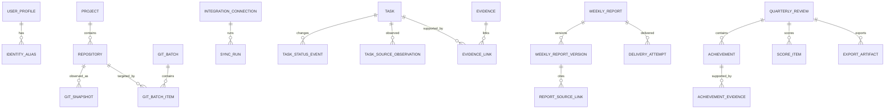

# 03 领域与数据设计

> `windowsSid` 向 `localIdentityKey + platform` 的兼容迁移、macOS 目录、sealed vault 和 DPAPI 跨平台边界见 [macOS 身份、配置与数据迁移](./macos-compatibility/03-identity-config-and-data-migration.md)。

## 1. 数据设计原则

- SQLite 是本机事实缓存和操作记录，不取代 Jira/GitLab/钉钉的源事实。
- 外部响应规范化后入库，同时保存必要的来源版本、哈希和时间，不大规模保存敏感原始报文。
- 业务日期使用 `YYYY-MM-DD`；时间点使用 UTC ISO-8601 或整数毫秒，展示统一转 Asia/Shanghai。
- 所有可编辑聚合根包含 `version` 实现乐观锁，所有表包含 `created_at`、`updated_at`（纯关联表除外）。
- 删除采用 `archived_at`/`disabled_at`；审计和已提交快照不可变。
- 密钥表只存 `credential_ref`、类型、掩码、最后验证时间，不存密文值。

## 2. 领域关系



## 3. 标识与枚举约定

- 内部 ID：UUIDv7 或同等时间有序、全局唯一字符串。
- 外部唯一键：GitLab `(connection_id, project_id)`；Jira `(connection_id, issue_key)`；Commit `(repository_id, sha)`；MR `(gitlab_project_id, iid)`；Pipeline `(gitlab_project_id, pipeline_id)`。
- 内容哈希：SHA-256，用于导入文件、来源快照、请求净化内容、导出文件和幂等请求体。
- 枚举值使用小写 snake_case，未知外部值保存在 `raw_*` 字段，不因无法映射而丢弃。

## 4. 身份、配置与集成表

### 4.1 `user_profile`

| 字段 | 类型/约束 | 说明 |
|---|---|---|
| id | text PK | 当前本机用户记录 |
| windows_sid | text unique | Windows SID，避免仅按显示名识别 |
| display_name | text | 页面显示名 |
| timezone | text default Asia/Shanghai | 业务时区 |
| workday_hours | integer default 8 check >0 | 人日换算，变更需版本化引用 |
| version | integer | 乐观锁 |

### 4.2 `identity_alias`

保存 `git_name`、`git_email`、`jira_account_id`、`jira_username` 等别名。唯一约束为 `(profile_id, alias_type, normalized_value)`；记录 `verified_at` 和来源。证据匹配只使用已验证或用户明确启用的别名。

### 4.3 `integration_connection`

| 字段 | 说明 |
|---|---|
| type | `gitlab/jira/dingtalk_log/dingtalk_robot/ai` |
| name/base_url | 连接名称与基础地址 |
| credential_ref | 本地保险箱引用，可空（例如仅本地 Git） |
| credential_mask | 只用于展示 |
| enabled/status | 启用状态与 `unknown/testing/healthy/degraded/invalid/disabled` |
| capabilities_json | 版本化能力探测结果，不含秘密 |
| config_json | 非敏感配置；写入前按类型 schema 校验 |
| last_tested_at/last_success_at | 连接状态时间 |
| version | 乐观锁 |

`credential_ref` 删除与连接禁用分开：撤销本地配置会删除保险箱条目并将连接置 invalid；保留历史操作中的连接 ID 和掩码，不保留密钥。

### 4.4 `field_mapping_version`

保存连接、版本号、生效时间、字段用途到外部 field ID 的映射、状态映射、Sprint/父子/工时解析规则、创建者和验证样本摘要。同步运行必须引用具体版本；新映射不回写解释历史快照。

## 5. 项目、仓库与 GitLab 表

### 5.1 `project`

业务项目，可关联一个或多个仓库及 Jira project key。字段包括名称、别名、说明、启用状态、排序、归档时间。项目不是 GitLab project 的同义词。

### 5.2 `repository`

| 字段 | 约束/说明 |
|---|---|
| project_id | 可空；发现后可人工归属 |
| canonical_path | unique，规范化绝对路径 |
| real_path_hash | 用于检测路径替换/链接变化 |
| display_name/alias | 用户确认值 |
| git_dir_kind | normal/worktree/bare；首版拒绝 bare 写操作 |
| remote_name/remote_url | 默认 origin 与脱敏 URL |
| gitlab_project_ref | 可空 |
| baseline_branch | 创建分支基线 |
| whitelist_status | discovered/confirmed/disabled/missing |
| last_seen_at | 最近扫描时间 |
| version | 乐观锁 |

约束：只有 `confirmed` 能执行写动作；路径不存在标记 missing，不直接删除。

### 5.3 `git_snapshot`

保存一次状态观测：HEAD SHA、分支、detached 标志、upstream、ahead/behind、staged/unstaged/untracked/conflicted 数量、文件路径摘要、stash 数、最近提交摘要、采集时间、错误码。保留近期详细快照，较老数据可按策略聚合/清理。

### 5.4 GitLab 缓存

- `gitlab_project`：外部 project ID、path_with_namespace、web_url、default_branch、可见性和 last_activity。
- `gitlab_branch`：project + name、sha、protected、default、merged、last_seen_run。
- `git_commit`：repository/project + sha、作者、提交者、title、message 摘要、committed_at、web_url；不保存 diff。
- `merge_request`：project + iid、title、state、source/target、author、assignee、merge/updated 时间、web_url。
- `pipeline`：project + external ID、sha、ref、status、source、timestamps、web_url。
- `release`/`tag`：名称、sha、时间、描述摘要、链接。
- `gitlab_project_member`：project + user ID、显示名/用户名、只读 access level、状态、last_seen_run；仅用于身份提示和证据辅助，不作为本系统授权来源。

列表同步使用 `last_seen_run_id`；只有完整同步成功后才把未见记录标记 stale，避免分页失败造成误删。

## 6. Git 批次表

### 6.1 `git_batch`

字段：动作枚举、规范化参数 JSON、状态、预检版本、创建者、创建/过期时间、批准人/批准时间、批准请求哈希、执行起止、汇总计数、取消原因。

状态：

```text
draft -> previewing -> previewed -> approved -> running -> completed
                    \-> preview_failed
previewed -> expired/cancelled
approved/running -> partial_failed/failed/needs_review
```

批准只能作用于仍未过期、请求哈希一致的 `previewed` 批次。默认预检有效期 10 分钟，可因任何目标仓库变化提前失效。

### 6.2 `git_batch_item`

逐仓库保存：预检 HEAD/分支/upstream/工作区摘要、展示命令（脱敏）、风险、可执行性、阻断原因、批准选择、执行前复核、退出码、结果、操作后 HEAD、输出摘要和耗时。唯一约束 `(batch_id, repository_id)`。

### 6.3 `git_operation_event`

不可变事件流，记录 item 的状态变化、Worker request ID、时间、领域错误和审计关联。它用于恢复和问题诊断，不保存凭证。

## 7. Jira、导入与任务表

### 7.1 `task`

| 字段组 | 字段 |
|---|---|
| 身份 | id、primary_source、connection_id、issue_key、project_key |
| 层级 | issue_type、parent_task_id、parent_issue_key、parent_title |
| 内容 | title、description_policy（默认不持久化或按配置）、priority |
| 人员 | assignee_external_id、assignee_name、is_current_user |
| 状态 | raw_status_id/name、normalized_status |
| 计划 | planned_start_date、due_date、original/remaining/time_spent_seconds |
| 分类 | sprint_ids_json、labels_json、components_json |
| 同步 | external_updated_at、last_observed_at、visibility_state、mapping_version_id |
| 并发 | version |

Jira 任务唯一约束 `(connection_id, issue_key)`。Excel 无 issue key 的补充任务使用稳定来源键 `(import_source_id, sheet_name, normalized_row_fingerprint)`，后续可人工合并但不能静默碰撞。

### 7.2 `task_status_event`

从 Jira 观测差异推导：task、from/to raw/normalized 状态、effective_at（Jira updated）、observed_at、source_observation_id。若 Jira search 不包含 changelog，只能声明“在两次观测间发生变化”，不能伪造精确变更时间。

### 7.3 `task_source_observation`

记录每次来源观测的字段摘要、来源更新时间、内容哈希、同步运行和映射版本。用于解释 Jira 与 Excel 的合并结果。

### 7.4 `task_import` / `task_import_row`

`task_import` 保存文件名、SHA-256、大小、工作表清单、状态、预检统计、提交时间和导入策略版本。`task_import_row` 保存 sheet、1-based row、原始字段 JSON、继承后字段、规范化结果、匹配到的任务、动作（create/supplement/skip/conflict）和错误/警告。

状态：`uploaded -> inspecting -> previewed -> committed`，异常为 `invalid/preview_failed/commit_failed/partial_committed`。提交在本地数据库内必须原子；若无外部写，不应出现逐行部分提交，`partial_committed` 只留给未来扩展或迁移恢复。

### 7.5 `sync_cursor` / `sync_run`

- `sync_cursor`：连接 + scope 唯一，保存 last_updated、last_tiebreaker、overlap_seconds、last_success_run。
- `sync_run`：类型、触发方式、字段映射版本、查询摘要、页数、读取/新增/更新/未变/错误数、起止时间、状态、错误分类。
- 水位只在完整成功后更新；失败运行保留诊断但不覆盖成功水位。

## 8. 证据模型

### 8.1 `evidence`

统一引用 Git branch/commit/MR/pipeline/release、Jira 观测、周报版本或人工材料。字段：source_type、source_internal_id、source_external_key、project_id、event_at、title、url、content_hash、availability_state。

### 8.2 `evidence_link`

连接 task/achievement/report segment 与 evidence：target_type/id、method、confidence(0～1)、status(suggested/confirmed/rejected/expired)、explanation、rule_version、confirmed_by/at。相同 target + evidence 仅一个活跃关系。

自动关系必须可撤销；用户拒绝后保存 rejection，除非来源内容或规则版本改变，不应每次同步重复建议。

## 9. 周报表

### 9.1 `weekly_report`

聚合根字段：period_start/end、report_date、template_name、status、current_version_id、confirmed_version_id、recipient_scope_version、schedule_at、version。

状态详见 06；数据库使用基础状态 + 交付子状态，避免单枚举组合爆炸：

- 编辑状态：collecting/generated/editing/confirmed。
- 日志交付：not_started/submitting/submitted/failed/unknown。
- 机器人交付：not_started/notified/failed/skipped。
- 页面派生显示 `partial_delivery`。

### 9.2 `weekly_report_version`

不可变：version_no、origin(rule/ai/manual)、parent_version_id、六字段正文、附件元数据、接收范围快照、source_snapshot_id、AI generation ID、change_summary、created_by/at。正文每字段保存纯文本和结构化段落 JSON，提交时由模板映射器转换。

### 9.3 `report_source_snapshot` / `report_source_link`

快照保存覆盖周期、筛选条件、任务/证据 ID 及其当时摘要哈希。link 细化到 report version + field + paragraph/block，支持页面从段落跳到证据。

### 9.4 `delivery_intent` / `delivery_attempt`

意图保存报告、确认版本、通道、幂等键、请求哈希、外部目标摘要。attempt 保存序号、请求时间、结果分类、HTTP/供应商错误、外部 ID、响应摘要、可重试时间。秘密和完整周报不写日志表；正式正文已在版本表中。

## 10. AI 表

### 10.1 `ai_provider_config`

保存协议、base URL、model、credential_ref、enabled、metadata_only、允许用途、超时、最大输入/输出、参数版本。base URL 必须通过 SSRF 策略校验；连接测试不回显密钥。

### 10.2 `ai_generation`

保存 purpose、provider config version、prompt template version、sanitization policy version、输入对象引用与净化后哈希、可选净化输入（按留存政策）、原始输出、解析输出、token/耗时、状态、错误、安全拦截和用户采纳状态。

禁止在此表保存 Token、源代码、diff、附件或被策略拒绝的字段。若企业政策不允许保存净化后的完整输入，只保存哈希、字段清单和引用。

## 11. 季度绩效和导出表

- `quarterly_review`：年份、季度、日期范围、状态、公式版本、当前总结版本、version。
- `achievement`：review、project、title、situation/action/result/impact、时间范围、来源类型、选择状态、AI/人工、排序、版本。
- `achievement_evidence`：achievement + evidence，相关性、说明、是否主证据。
- `performance_metric`：指标模板版本、名称、权重、分数范围、必填规则、排序。
- `achievement_metric_link`：成果到指标的多对多映射和贡献说明。
- `score_item`：review + metric、AI 建议分/理由、用户分/理由、加权分、校验状态。
- `review_narrative_version`：自评文本不可变版本、来源和 AI generation。
- `export_artifact`：类型 xlsx/docx、模板版本、输入快照哈希、路径、文件哈希、大小、生成结果和时间。

总分不只存最终数字，还存公式版本、输入分项和计算明细，确保可重算与审计。

## 12. 作业、审计与运行表

### 12.1 `job`

字段：type、payload_ref、priority、status、scheduled_at、lease_owner/until、attempt_count/max、dedupe_key、cancel_requested、last_error、timestamps。唯一活跃去重键避免重复调度。

### 12.2 `audit_event`

不可变字段：event_id、occurred_at、actor_type/id、action、target_type/id、correlation_id、approval_id、outcome、before/after 的非敏感摘要哈希、client session、错误码。审计日志不得包含 Token、Webhook、Authorization、源代码、完整 diff 或完整外部响应。

### 12.3 `app_event_log`

用于诊断的结构化日志，与审计分离；包含 level、component、event_name、correlation_id、duration、error class 和脱敏属性。按大小/日期轮转。

## 13. 索引与约束

关键索引：

- repository(canonical_path unique)、repository(whitelist_status, last_seen_at)
- git_commit(repository_id, committed_at desc)、git_commit(sha)
- task(connection_id, issue_key unique)、task(is_current_user, normalized_status, due_date)
- task(external_updated_at, issue_key)、task(parent_task_id)
- evidence(project_id, event_at)、evidence_link(target_type, target_id, status)
- weekly_report(period_start, period_end unique where not archived)
- delivery_intent(channel, idempotency_key unique)
- job(status, scheduled_at, priority)、job(dedupe_key partial unique for active states)
- audit_event(occurred_at)、audit_event(target_type, target_id)

检查约束：confidence 0～1；工时非负；period_start ≤ period_end；权重和分数范围有效；确认版本必须属于同一报告；外部 URL 只允许 http/https；状态转换由应用规则和条件更新共同保证。

## 14. 数据迁移与兼容

- 使用顺序迁移号和 schema checksum；启动时只允许向前迁移，迁移前自动做一致备份。
- 破坏性迁移采用“新增列/表—回填—切读—延后清理”，不在同一版本直接丢历史字段。
- 字段映射、规则和模板是业务版本，不与数据库 schema 版本混淆。
- 数据库来自更高应用版本时拒绝启动写模式，允许提供只读诊断信息。

## 15. 留存建议（待企业确认）

| 数据 | 默认建议 |
|---|---|
| 审计、批准、正式提交、绩效导出元数据 | 至少 2 年或企业规定 |
| 周报/绩效版本与来源快照 | 至少 2 年 |
| Git/Jira 规范化元数据 | 1 年滚动；源系统可重新获取部分例外 |
| 详细 Git 状态快照 | 30 天，之后仅保留操作相关快照 |
| 同步/任务运行明细 | 成功 90 天、失败 180 天 |
| 应用诊断日志 | 30 天且按大小限制 |
| AI 净化输入/原始输出 | 默认 90 天；可配置为只留哈希 |
| 导入原文件副本 | 默认不保存；用户选择后按项目策略 |
