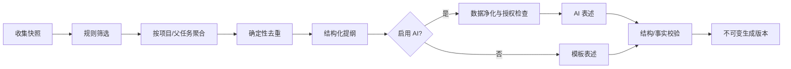
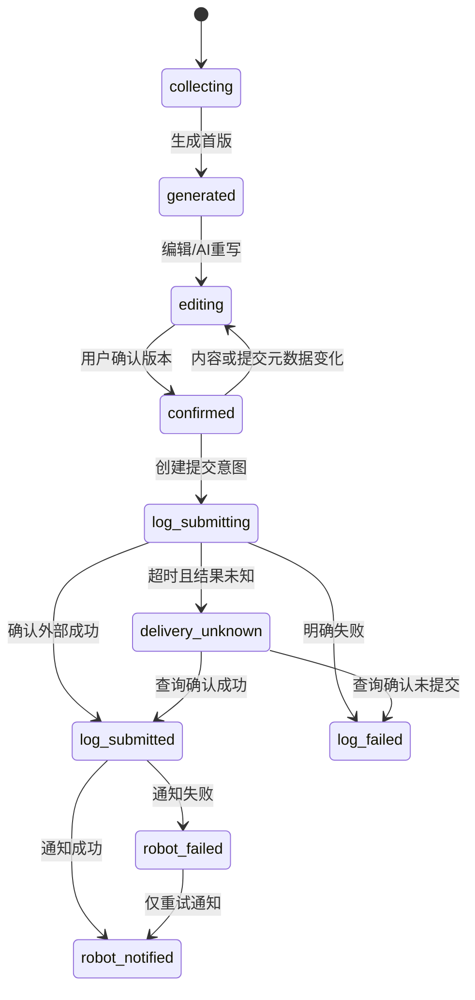

# 06 周报、钉钉与 AI 详细设计

> macOS 无接口权限钉钉桌面提交的签名桥接、系统权限、AX/Vision、v2 协议、防重和 unknown 处理见 [macOS 钉钉桌面桥接](./macos-compatibility/05-macos-dingtalk-desktop-bridge.md)。

## 1. 目标和边界

系统从可追溯的 Jira/Git/人工事实生成周报草稿，用户修改并确认后，才通过钉钉正式日志通道提交；Custom Webhook 只承担提醒和短摘要。AI 是可替换的表述服务，不是事实源、执行器或审批者。

## 2. 周报周期和六字段

每份周报保存：`periodStart`、`periodEnd`、`reportDate`。默认覆盖当前自然工作周，填写日期为该周最后一个工作日；工作日按版本化企业日历判断，未配置时使用周一至周五并明确提示“未应用节假日调整”。

正式六字段固定语义：

1. 周报填写日期。
2. 近期工作目标。
3. 本周工作内容。
4. 下周工作计划。
5. 需要协助或存在的问题。
6. 其他补充。

附件、接收人、接收群、仅接收人可见和预约时间是提交元数据，不计入六字段。

## 3. 报告收集快照

点击生成前先创建快照，保证后续可复现。快照包含：

- 周期、时区、工作日历版本、当前用户身份版本。
- Jira 查询条件、同步运行、任务 ID 和当时字段摘要。
- Git/GitLab 证据 ID、状态/时间/链接和确认关系。
- 用户手工目标、临时计划、问题、会议/调研等输入。
- 未同步或过期来源的警告。
- 规则版本、模板映射版本和 AI 净化策略版本。

只有同步成功的数据才可标“最新”；用户可以在来源过期时继续生成，但确认页必须显示风险并记录选择。

## 4. 生成管线

先规则后 AI，防止模型决定哪些事实存在。AI 输出必须引用输入中的 block/evidence ID；校验器拒绝未知 ID、缺字段、越权动作或明显数值漂移。校验失败回退到规则版本，并保留失败记录。

## 5. 字段生成规则

### 5.1 近期工作目标

候选：当前 Sprint 未完成任务、未完成 Jira 父任务、未来 14 天开始/到期任务、用户手工目标。聚合键优先父任务，其次项目/阶段。去除仅容器且无当前用户工作项的父任务。输出每项目/阶段 1～3 条目标，表达目标和预期结果，避免列出所有子任务。

排序：用户置顶 → blocked/高优先级 → 近期到期 → Sprint → 项目排序。手工目标始终保留并标人工来源。

### 5.2 本周工作内容

候选优先级：

1. 本周观测到状态变化的个人任务。
2. 本周完成、推进或有工时/计划进展的任务。
3. 与上述任务确认关联的 Commit、MR、Pipeline、Release。
4. 当前用户本周未关联 Git 证据，作为“待确认候选”。
5. 人工补充。

按项目 + 父任务/成果聚合，结构化块包含：工作内容、结果/产出、状态、工时、证据。Commit message 只能作为证据摘要，不能逐条复制。多 Commit 归纳为业务动作；Pipeline 失败不能表述为已发布。

工时优先实际工时，其次明确预估；两者均有时分开展示。空工时不显示 0。Excel 补充工时带来源标识，正式文本可省略来源但证据面板保留。

### 5.3 下周工作计划

候选：下周开始/到期、当前未完成、本 Sprint 剩余、从本周顺延、用户临时计划。已 cancelled/done 不进入，除非用户明确添加后续工作。逾期未完成任务显示“继续/收尾”并提示风险，不伪装为新计划。

每条计划包含目标、下一步、预期完成点和可选工时。没有来源的 AI 新计划不得写入。

### 5.4 协助与问题

确定性来源：blocked、逾期、失败 Pipeline、Git 冲突、跨团队依赖、用户输入。每项使用“问题—影响—所需协助/下一步—责任方（若已知）”结构。不能从普通延期自动推断责任方。无候选且用户未输入时精确填“暂无”。

### 5.5 其他补充

仅收录未被前述字段吸收的调研、会议/评审、临时协作、AI 提效、文档和非 Jira 工作。去重键基于来源 ID/人工项 ID，不因文字相似就丢弃事实。

### 5.6 日期字段

正式提交按钉钉模板字段类型输出。若模板要求日期时间，使用业务日期约定时间并明确时区；若文本日期则使用 `YYYY-MM-DD`。模板能力探测必须验证字段准确名称、类型、顺序和必填性。

## 6. 编辑、版本与确认

### 6.1 编辑体验

- 六字段分区编辑，右侧显示结构化来源卡片。
- 每个生成段落可查看 Jira/Git/人工证据、来源时间和数据新鲜度。
- 支持恢复任一历史版本、字段级比较、撤销/重做和自动保存。
- AI “重写”以字段或选中块为单位，必须创建新版本，不能覆盖人工版本。
- 用户可排除候选、合并/拆分段落或标记证据不相关；选择反馈进入关联记录。

### 6.2 确认条件

确认前验证：六字段完整；日期/周期有效；“问题”非空；未解决 blocking 警告为 0；附件和接收范围有效；钉钉模板映射未过期；当前版本无并发变化。对于 stale source、未确认 Git 候选、AI 生成内容等 warning，用户可明确勾选知悉。

确认锁定版本号和内容哈希。已确认后任何正文、附件、接收范围、模板映射变化都会产生新版本并回到 editing；正式提交按钮只对当前确认版本可用。

## 7. 周报状态机

`partial_delivery` 是“日志成功 + 机器人未成功”的派生页面状态，不允许从该状态重新提交正式日志。

## 8. 钉钉能力分工与正式日志适配

“AI小钉”保留为钉钉群内的官方智能辅助和日历提醒能力，用户可以在钉钉侧独立使用；本系统不调用或依赖它访问 GitLab/Jira，也不把它当正式日志提交通道。正式日志由日志适配器负责，群摘要/提醒由 Custom Webhook 负责。GitLab/Jira 群机器人首版默认不启用，避免事件噪声；未来如增加，只能按项目和严重事件单独配置。

### 8.1 能力前置

公开资料证明钉钉存在日志和机器人能力，但公司组织内具体 OpenAPI/MCP、应用权限、套餐、模板能力未在需求中证实。因此正式实现必须先完成能力探测，选择经批准的日志接入方式；内部 `DingTalkLogPort` 保持不变。

能力契约至少包括：

- 获取/定位模板（按稳定 ID，名称仅作首次发现）。
- 获取模板字段及类型。
- 校验接收用户/群标识。
- 上传/引用附件（可选）。
- 创建正式日志。
- 按业务幂等标识或时间/用户查询提交结果。
- 返回外部日志 ID 和可打开链接/标识。

若目标方式不能可靠查询超时结果，正式提交需要更强的用户提示，并在 unknown 时禁止自动重试。

### 8.2 模板映射

首次设置读取 `uTwin产研创新部周报` 候选，用户确认模板 ID；逐字段映射到六个内部字段，并保存外部字段 ID、名称、类型、顺序、必填和限制。每次提交前用模板版本/哈希复核；字段变化使确认失效。

### 8.3 接收范围

接收人/群使用外部稳定 ID，不只存名称。提交前去重并验证仍可用。`recipientOnly` 的业务含义必须以目标 API 实测为准；UI 用明确中文解释可见范围。默认不预选扩大可见范围。

### 8.4 附件

只提交用户显式添加的附件，校验存在、大小、MIME、扩展名和钉钉限制。附件内容不送 AI。上传成功但日志失败时保存临时外部文件 ID 和过期/清理策略，避免重复上传；未确认模板不上传。

### 8.5 幂等与未知结果

本地幂等键由 report ID + confirmed version + channel 构成。点击提交先原子创建唯一意图。明确 4xx 失败可修正后创建同版本的新 attempt；429/5xx 可按 Retry-After 安全重试；网络超时进入 unknown，先查询或人工核对。得到外部 ID 后任何重放直接返回原结果。

### 8.6 降级复制

日志能力不可用时提供六字段预览和“复制为钉钉模板文本/导出附件”，清楚标记“未正式提交”。系统不能用机器人发送完整周报冒充正式日志，也不能自动操作网页登录页面。

## 9. Custom Webhook 机器人

### 9.1 安全配置

只允许加签模式。Webhook 和 Secret 均进入本地保险箱；数据库保存群标识、机器人名、掩码和引用。测试消息需用户明确点击，正文固定为无敏感信息的连接测试，结果留审计。

签名计算使用供应商规定的 timestamp + secret 算法，时间单位、URL 编码和允许时钟偏差通过官方文档/实测固定。系统时钟偏差过大时停止发送并提示校时。

机器人可在设置中禁用或替换 Webhook/Secret。所谓“重新生成”是用户在钉钉侧生成新凭证后在本机替换；系统不得声称能远程轮换供应商 Secret，除非能力探测证明有获批 API。替换成功后旧秘密立即从本地保险箱删除，历史通知只保留机器人名称和掩码引用。

### 9.2 消息类型

- 截止提醒：周期、截止时间、草稿状态、打开本机系统的提示（不能发送不可访问的 localhost 链接给他人）。
- 提交成功摘要：日期、状态、最多若干主要项目、正式日志 ID/可访问链接。
- 提交失败提醒：阶段、简化错误、建议在本机查看，不含请求体/凭证。
- 可选风险通知：只对用户配置的严重规则启用，做频控/合并。

完整周报、Token、Webhook、客户信息、附件内容禁止进入机器人消息。

### 9.3 频控与去重

通知去重键 = 业务对象 + 通知类型 + 状态版本。失败按 429/5xx 重试，设置最大次数；内容相同的提醒在静默窗口内合并。测试消息不影响业务通知去重。

## 10. AI 提供商层

### 10.1 支持协议

统一端口支持 OpenAI-compatible、Anthropic、Gemini。协议适配负责鉴权头、请求格式、结构化输出、usage、停止原因和错误转换；领域层只提交 `GenerationRequest` 的用途、许可数据块、输出 schema、语言和限制。

连接配置包括模型名称、base URL、密钥引用、元数据模式、超时、最大 token、温度策略和允许用途。模型可用性必须连接测试，不能仅保存字符串。

### 10.2 数据分类和净化

| 分类 | 默认处理 |
|---|---|
| 允许 | Jira 标题/状态/工时、项目名、Commit message、分支名、MR 标题、用户手工补充 |
| 条件允许 | 人员姓名、内部 URL、Jira 描述摘要；须企业策略和用户确认 |
| 禁止 | 源码、完整 diff、环境变量、配置、任何 Token/Webhook、客户数据、附件内容 |

净化器按字段白名单构造新对象，不做“先收集再删除”。字符串还需扫描疑似密钥、Authorization、私钥、连接串和高敏标记；命中则阻断或替换，并在 UI 显示被移除字段类别，绝不回显秘密。

### 10.3 Prompt 与输出约束

- Prompt 模板版本化，明确只使用给定事实、不得虚构状态/工时/结果、不得给出执行动作。
- 每个输入块有不可猜测的本地引用 ID，输出必须返回结构化段落及引用。
- 数值、日期、issue key、项目名由确定性校验器复核；出现输入外事实则标 unsupported。
- AI 服务不可用、拒绝、安全拦截或输出不合格时使用规则模板，不阻止用户手工编辑。
- 不把供应商返回文本当 Markdown/HTML 直接执行；前端安全渲染。

### 10.4 AI 版本和可解释性

每次生成记录供应商配置版本、模型、prompt 版本、净化策略、输入引用/哈希、输出、耗时和采纳情况。页面明确区分“规则生成”“AI 建议”“人工编辑”。用户可以查看模型使用了哪些数据类别和来源，但密钥永不展示。

### 10.5 AI 绝对权限边界

AI 没有 Git Worker、Jira 写、钉钉提交、文件读取或绩效确认工具。即使输出包含动作文本，也只作为普通不可信文本处理。任何未来工具调用能力必须另立需求和安全评审，不属于首版。

## 11. 提醒调度

用户配置工作周、生成提醒、确认提醒和截止提醒。调度按 Asia/Shanghai，处理休眠错过：恢复后在宽限期内补发一次，超出则记录 skipped。正式提交仍只能用户触发；预约 `scheduledAt` 若用于钉钉日志，必须被明确批准，并在预约前源版本变化时自动取消而不是提交旧/新混合内容。

## 12. 验收重点

- 六字段完整、来源正确、空问题为“暂无”，不逐条复制 Commit。
- 周期、填写日期、时区和工作日历语义正确。
- 任一人工修改使旧确认失效；提交只能使用确认版本。
- 重复点击和网络超时不生成重复日志。
- 日志成功、机器人失败可独立恢复。
- 机器人从不包含完整周报或敏感字段。
- AI 输入白名单、秘密扫描、引用校验和无 AI 回退均通过测试。
