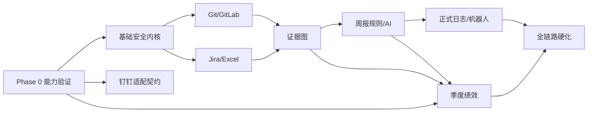

# 12 实施计划、风险与决策记录

## 1. 说明

本文件是后续编码阶段的完整实施蓝图，不代表当前开始编码。阶段按依赖和风险排序；每阶段都包含产品、设计、实现、测试、运维资产，不能只以“接口写完”判定完成。

## 2. 实施前验证门（Phase 0）

在任何业务代码进入“完成”前，先用受控测试账号/资源验证：

1. GitLab 版本、PAT scope、项目可见性、分页、MR/Pipeline/Release 字段。
2. Jira 版本、认证、search POST、分页上限、字段 ID/类型、状态和 Sprint/父子/工时。
3. 钉钉企业应用权限、日志模板读取/创建/查询、附件、接收范围和模板限制。
4. Custom Webhook 加签、群策略、频控和测试消息。
5. 企业工作日历、周报字段限制、绩效指标/公式与 Word/Excel 模板。
6. 外部 AI 白名单、数据政策、供应商/区域、日志与留存要求。

产物：能力矩阵、脱敏契约样例、字段映射草案、模板映射、风险更新。任一项不可用时必须选择经批准的降级方案，不能私自用浏览器自动化或机器人替代正式能力。

## 3. 工作分解

### 阶段一：基础与安全内核

工作包：本机服务/SPA 壳、配置与环境校验、SQLite schema/迁移、Windows 密钥保险箱、会话/CSRF/CSP、身份别名、审计/日志、作业/租约、备份与健康页。

完成定义：

- loopback 与同源防护测试通过。
- 秘密只存保险箱引用，替换/撤销/脱敏通过。
- 状态机/幂等/作业恢复基础可复用。
- 数据库迁移和备份恢复演练通过。

### 阶段二：项目、GitLab 与本地 Git

工作包：发现向导、仓库 registry/白名单、受限 Worker、读状态、GitLab 适配/能力探测、仓库中心、批次预检/批准/执行、锁和恢复。

建议先交付只读发现/状态，再逐动作加入写能力，每个动作单独过安全矩阵。禁止先提供 raw shell 再补限制。

完成定义：14 仓库验收、无 Token 降级、允许动作全矩阵、禁止动作三层不可表达、部分失败与 stale preview 清晰。

### 阶段三：Jira、Excel 与证据

工作包：Jira 连接/字段向导、分页/复合水位、任务读模型、样表解析/预检/提交、逐字段 provenance、身份归属、Git 证据规则和确认 UI。

完成定义：防漏同步、字段漂移恢复、三表样例、空工时语义、Jira 主 Excel 补、证据生命周期验收。

### 阶段四：周报规则与 AI

工作包：报告快照、六字段规则、来源块、版本/比较/确认、三 AI 协议、净化/秘密扫描、结构化引用校验、无 AI 回退。

完成定义：黄金周报样例、所有来源可追溯、人工编辑不丢、AI 无权限且越权数据被阻断。

### 阶段五：钉钉正式日志和机器人

工作包：经 Phase 0 选择的日志适配、模板映射、接收范围/附件、提交意图/unknown 恢复、机器人加签/频控、提醒、降级复制。

完成定义：正式通道与摘要职责分离、重复点击/超时/部分交付测试、模板变更阻断、测试群验收。

### 阶段六：季度绩效与导出

工作包：季度收集、候选池、聚类/去重建议、成果编辑、指标模板、评分明细、AI 自评、确认、Excel/Word 模板和渲染 QA。

完成定义：多来源对账、不同分项、总分公式、证据索引、文件视觉 QA、无自动外发。

### 阶段七：全链路硬化与发布

工作包：性能、故障注入、安全评审、依赖/SBOM、安装升级回滚、运行手册、UAT、数据留存、用户说明。

完成定义：11 文档的发布门禁全部通过。

## 4. 依赖关系

Git/GitLab 与 Jira/Excel 可在基础内核后并行，但证据、周报和绩效依赖两者稳定语义。

## 5. 每个工作包的通用完成定义

- 关联需求 ID、ADR、API、数据迁移、页面和测试。
- 正向、异常、权限、幂等、恢复场景自动化。
- 日志/审计/指标完整且通过秘密扫描。
- 用户可理解错误与下一步，不只记录后台 stack trace。
- 外部契约有脱敏 fixture 和能力差异处理。
- 说明数据留存、升级/回滚和已知限制。
- 文档与实现同变更提交；需求追踪状态更新为 verified 后才可验收。

## 6. 架构决策记录（ADR 摘要）

| ADR | 决策 | 理由 | 后果 |
|---|---|---|---|
| ADR-001 | Windows 单机 loopback Web | 需要当前用户 Git 环境且范围为个人工作台 | 不支持多用户/远程共享 |
| ADR-002 | SQLite WAL + 持久化作业 | 部署简单，规模适合，需崩溃恢复 | 短事务、单写者约束 |
| ADR-003 | 受限 Git Worker，无 raw shell | 缩小命令注入和路径越界 | 每个动作需独立实现/测试 |
| ADR-004 | Git 写采用预检快照 + 批准 + 前置复核 | 防止确认与执行间状态变化 | 状态变化会要求重新预检 |
| ADR-005 | Jira 为主、Excel 逐字段补充 | 保持事实一致，仍支持兜底 | 必须保存 provenance/冲突 |
| ADR-006 | Jira 复合水位 + 重叠回读 | 避免同时间戳和分页漏数 | 会重复读取，需幂等 upsert |
| ADR-007 | 证据关系独立领域模型 | 周报与绩效共享且需人工确认 | 增加关系生命周期管理 |
| ADR-008 | 规则先行、AI 后置 | 限制幻觉和数据外发 | 需要结构化快照和输出校验 |
| ADR-009 | 钉钉日志和机器人双通道 | 正式记录与群提醒职责不同 | 独立状态/幂等/恢复 |
| ADR-010 | 跨系统使用意图记录/最终一致 | 无分布式事务且写结果可能未知 | 必须处理 unknown，不盲重试 |
| ADR-011 | 周报/绩效版本不可变 | 追溯 AI 与人工变化 | 存储增加，需留存策略 |
| ADR-012 | 指标公式版本化，未配置不出最终分 | 不猜公司绩效规则 | Phase 0 需取得模板/规则 |

## 7. 主要风险登记

| 风险 | 概率/影响 | 预防 | 触发后的处理 |
|---|---|---|---|
| 钉钉正式日志 API/权限不可用 | 中/高 | Phase 0 实测、端口隔离 | 降级复制/导出，绝不机器人冒充 |
| Jira 自定义字段/版本差异 | 高/中 | 字段向导、映射版本、契约 fixture | mapping_invalid，旧数据只读 |
| Git 批量操作伤及工作区 | 低/极高 | 白名单、固定动作、快照、锁、禁止命令 | 停止、needs_review、人工恢复 |
| 外部写超时导致重复 | 中/高 | 幂等意图、结果查询、unknown | 禁止盲重试，人工核对 |
| AI 泄露敏感数据/幻觉 | 中/高 | 白名单构造、秘密扫描、无工具、引用校验 | 阻断/回退、审计、轮换凭证（若疑似泄露） |
| Excel 公式/日期语义差异 | 高/中 | 同读公式/缓存/原始类型、预检 | 行级冲突，用户修正本次导入 |
| SQLite/磁盘损坏 | 低/高 | WAL、空间监控、备份/验证 | 停写、恢复演练流程 |
| 企业规则/绩效模板缺失 | 高/中 | 不生成最终分、开放版本化模板 | 先完成成果材料，等待规则确认 |
| 真实仓库规模导致慢 | 中/中 | 缓存、并发限流、超时、基准 | 仓库级优化，不牺牲预检正确性 |

## 8. 待确认决策清单

### 阻塞对应功能上线

- 钉钉日志实际接入方式、权限、模板字段和结果查询。
- Jira 认证方式及字段 ID/状态映射。
- 绩效模板、权重、公式、取整和导出样式。
- 企业外部 AI 允许供应商及元数据范围。

### 不阻塞基础开发但需发布前确认

- 工作日历/节假日来源。
- 数据/AI/审计留存期限。
- 备份目录、容量和是否纳入导出文件。
- 周报提醒时间、收件人/群和机器人频控。
- Git 仓库根是否永远固定 `D:\company`，是否允许未来多根。

## 9. 范围变更规则

以下请求视为重大变更，必须新 ADR/威胁评审/验收：远程/多用户访问、自动 Jira 写、AI 工具调用或源码读取、自动 Git Commit/Push、批量 merge/rebase、自动绩效提交、浏览器自动化提交钉钉、集中式服务部署。

## 10. 当前设计阶段完成标准

- 本目录 13 份文档互相链接且口径一致。
- `design.md` 的全部功能和禁止项都有详细落点。
- 真实 Excel 样表事实进入导入设计和测试。
- 外部平台未知项没有被猜测为已可用，而是转成能力验证门。
- 需求—设计—验收可追踪，后续团队能据此估算和拆任务。
- 未产生任何业务代码或外部系统写操作。

