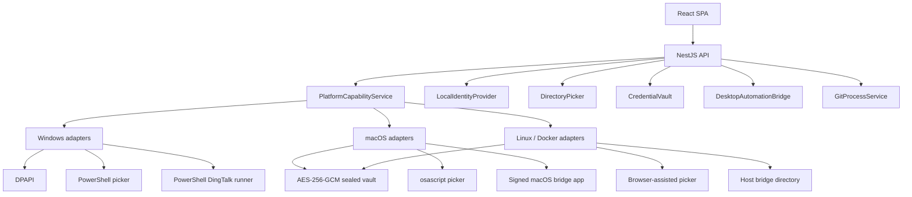
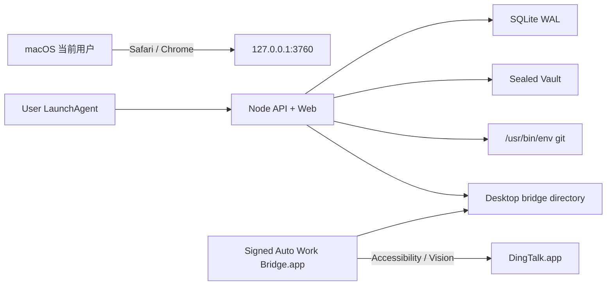
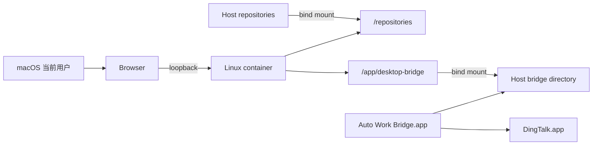

# 02 跨平台架构

## 1. 设计目标

跨平台改造不复制一套 macOS 业务系统，而是在现有模块化服务中增加平台端口。业务模块只依赖稳定能力契约；Windows、macOS 和 Docker 的差异由启动时选择的适配器承担。

核心目标：

1. 平台差异集中、可替换、可测试；
2. 不降低 Git、凭据、钉钉提交和本机 HTTP 的安全边界；
3. 不支持的能力显式降级，而不是运行时才发现某个 Windows 可执行文件不存在；
4. Windows 现有实现保持兼容；
5. macOS 原生与 macOS Docker 尽可能共享同一桌面桥接协议。

## 2. 逻辑架构



## 3. 平台能力服务

### 3.1 职责

`PlatformCapabilityService` 是进程平台事实的唯一聚合点，负责：

- 识别 `process.platform`、`process.arch` 和应用部署形态；
- 选择并公开已注册的平台适配器；
- 汇总原生能力、桥接心跳和系统权限状态；
- 为 API、设置页和提交前预检生成一致能力视图；
- 在启动时验证互斥配置，例如 macOS 禁止选择 DPAPI；
- 输出诊断事实，但不输出用户名、绝对路径、凭据引用或周报正文。

业务模块不得新增散落的 `process.platform === ...` 分支。仅平台模块、适配器装配和少数平台测试可直接读取运行平台。

### 3.2 能力状态

| 状态                  | 含义                         | 页面行为                 |
| --------------------- | ---------------------------- | ------------------------ |
| `supported`           | 能力已安装、依赖就绪且可调用 | 正常启用                 |
| `unavailable`         | 当前平台或部署形态不支持     | 隐藏操作或只展示说明     |
| `permission_required` | 平台支持，但缺少用户授权     | 禁用操作并显示授权入口   |
| `offline`             | 桥接或外部桌面客户端未运行   | 禁用写操作，允许刷新探测 |
| `degraded`            | 部分能力异常，仍有安全降级   | 仅提供明确列出的降级动作 |

状态不是缓存的永久配置。目录选择能力可在进程生命周期内稳定缓存；钉钉桥接和系统权限必须按心跳或探测刷新。

## 4. 平台端口

### 4.1 `LocalIdentityProvider`

```ts
interface LocalIdentity {
  platform: 'win32' | 'darwin' | 'linux';
  key: string;
  displayName: string;
  summary: string;
}

interface LocalIdentityProvider {
  read(): Promise<LocalIdentity>;
}
```

- Windows 适配器读取 SID，失败时仅开发/诊断环境允许受控回退。
- macOS 适配器使用固定路径 `/usr/bin/id -u` 获取数字 UID，以 `node:os.userInfo()` 提供显示名。
- Linux/Docker 使用容器用户身份，但单容器数据卷仍只允许一个资料主体。
- 错误不得包含 home 绝对路径。

### 4.2 `DirectoryPicker`

```ts
type DirectoryPickerResult =
  { status: 'selected'; path: string } | { status: 'cancelled'; path: null };

interface DirectoryPicker {
  readonly mode: 'native' | 'browser_assisted';
  select(initialPath?: string): Promise<DirectoryPickerResult>;
}
```

- Windows：现有 PowerShell 固定脚本。
- macOS 原生：固定 `osascript` 脚本。
- Docker/Linux：`browser_assisted`，服务端原生选择端点返回稳定冲突错误。
- 所有 `selected` 结果统一经过绝对路径、控制字符、`realpath`、目录类型和访问权限校验。

### 4.3 `CredentialVault`

沿用现有 `put/get/delete` 契约和引用前缀路由：

- Windows 原生 `auto` 选择 `dpapi`；
- macOS、Linux 和 Docker 的 `auto` 选择 `sealed`；
- `dpapi:` 引用只能在 Windows 原创建用户下读取；
- `sealed:` 引用要求持久主密钥；
- 切换默认后端不改变已有引用的读取路由。

### 4.4 `DesktopAutomationBridge`

```ts
interface DesktopBridgeReadiness {
  status: 'supported' | 'permission_required' | 'offline' | 'degraded';
  adapter: 'windows_uia_ocr' | 'macos_ax_vision';
  permissions: Record<string, 'granted' | 'denied' | 'unknown'>;
  clientRunning: boolean;
  checkedAt: string;
}

interface DesktopAutomationBridge {
  readiness(): Promise<DesktopBridgeReadiness>;
  probe(config: DesktopReportConfig): Promise<DesktopRunnerResult>;
  submit(config: DesktopReportConfig, content: DesktopSubmission): Promise<DesktopRunnerResult>;
}
```

Windows 原生可继续直调现有 PowerShell runner；Windows Docker、macOS 原生和 macOS Docker使用目录桥接。业务层只处理统一结果，不知道 UIA、Accessibility 或 OCR 的具体实现。

## 5. 部署进程

### 5.1 macOS 原生



- API 与桥接均属于当前图形登录用户。
- API 不直接取得辅助功能和屏幕录制权限；权限授予稳定 Bundle ID 的桥接应用。
- 桥接目录为 `0700`，消息文件为 `0600`，不监听网络端口。

### 5.2 macOS Docker Desktop



容器不能打开宿主机目录窗口或控制桌面。仓库挂载和桥接目录必须在容器创建前确定。

### 5.3 Windows 原生与 Docker

Windows 原生继续使用 PowerShell 目录选择器、DPAPI 和现有钉钉 runner。Windows Docker 继续通过宿主机桥接目录。跨平台重构后，Windows 适配器的返回协议和错误码保持兼容。

## 6. 适配器选择规则

| 部署模式 | 平台       | 身份               | 目录选择         | 新凭据 | 钉钉桌面                  |
| -------- | ---------- | ------------------ | ---------------- | ------ | ------------------------- |
| `native` | `win32`    | Windows SID        | Windows native   | DPAPI  | Windows direct/bridge     |
| `native` | `darwin`   | POSIX UID          | macOS native     | sealed | macOS bridge              |
| `native` | `linux`    | POSIX UID          | browser assisted | sealed | unavailable，除非显式桥接 |
| `docker` | Linux 容器 | container identity | browser assisted | sealed | host bridge               |

装配顺序：

1. 解析显式 `AUTO_WORK_DEPLOYMENT_MODE`；未配置时仅把 `0.0.0.0` 视为 Docker 的兼容回退。
2. 验证平台与配置组合。
3. 注册单一身份、目录和默认凭据适配器。
4. 桥接按配置目录和最新心跳决定状态，不因平台被静态宣称为 ready。
5. 启动诊断列出能力摘要，秘密和绝对路径只保存哈希。

## 7. 路径与文件系统语义

### 7.1 规范化顺序

所有受信本机路径采用以下顺序：

1. 拒绝 NUL、CR、LF 和空字符串；
2. 使用平台 `isAbsolute` 验证外部选择结果；
3. 使用 `resolve` 得到语法绝对路径；
4. 使用 `realpath` 解析符号链接和真实大小写；
5. 使用 `stat/lstat` 验证类型；
6. 使用 `relative(root, candidate)` 验证边界；
7. 子进程 cwd 只使用已校验真实路径。

### 7.2 大小写

- 不再全局用 `toLowerCase()` 判断路径相等。
- Windows 可以使用大小写无关比较。
- macOS 必须以 `realpath` 结果和目录边界验证为主，因为 APFS 既可能大小写不敏感也可能大小写敏感。
- 业务 ID 不由未经规范化的路径字符串直接生成。

### 7.3 符号链接

- 仓库扫描根目录下的一级符号链接默认跳过。
- 已登记仓库每次写操作前重新解析真实路径、仓库 identity 和 Git 顶层。
- `.git` 文件形式的 worktree 继续支持，但其工作树必须位于允许根目录的一级子目录。
- 桥接、导出和备份路径必须使用精确根目录加 `relative` 边界校验，禁止前缀字符串误判。

### 7.4 SQLite URL

数据库文件路径由统一 helper 转换为 Prisma `file:` URL；反向解析时使用 `fileURLToPath` 或平台路径逻辑，不把 `/` 无条件替换为 Windows 反斜杠。诊断、备份、恢复和 Prisma CLI 必须使用同一转换函数。

## 8. 错误与降级

- 适配器启动失败转换为稳定领域错误，不直接回显可执行文件完整路径或系统异常堆栈。
- `unavailable` 不能伪装为成功；页面只允许手工粘贴、下载或重新探测等明确降级。
- 桌面提交进入“可能已经点击提交”的阶段后，任何进程异常都必须收敛为 `unknown`。
- 原生目录选择失败不改变已保存仓库根目录。
- Git 凭据不可用时保持非交互失败，不弹出不可控终端凭据窗口。

## 9. Windows 兼容原则

- 保留 `dpapi:` 引用读取和 Windows SID 回填。
- 保留 PowerShell 目录选择脚本的参数、超时和输出限制。
- 保留现有 Windows 钉钉 runner 协议；桥接 v1 在过渡期仍可读取。
- Windows 页面不显示 macOS 权限引导。
- Windows 真实 Git 和发布门禁继续作为发布阻断项。
