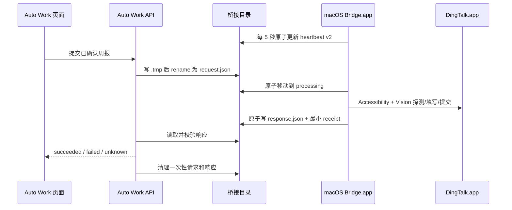
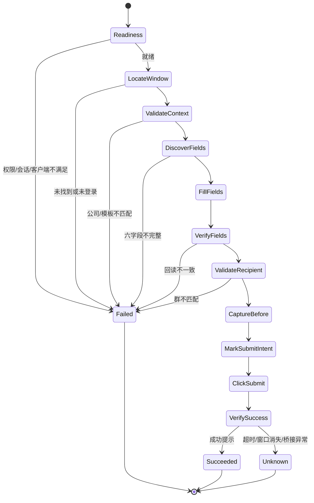

# 05 macOS 钉钉桌面桥接

## 1. 目标与安全边界

macOS 桥接解决“当前用户可以在钉钉客户端手工提交日志，但没有企业 OpenAPI 权限”的场景。它不是钉钉服务端 API，也不能查询公司日志列表；成功只能由本次客户端成功提示和本地证据证明。

必须保持以下边界：

- 只处理 Auto Work 已确认的六字段周报版本。
- 必须在当前已登录、未锁屏的图形会话运行。
- 提交前校验公司、模板、六字段和接收群。
- 不使用固定屏幕绝对坐标。
- 点击提交后结果不明确时返回 `unknown`，禁止自动重试。
- 桥接不监听网络端口，不保存凭据，不把正文写入普通日志。
- 本地回执不是钉钉 OpenAPI 日志 ID。

## 2. 组件与部署

### 2.1 应用形态

桥接交付为 Universal macOS 应用：

- 名称：`Auto Work Desktop Bridge.app`
- Bundle ID：`com.autowork.desktopbridge`
- Deployment target：macOS 13.0
- 架构：`arm64`、`x86_64`
- 运行方式：用户级 LaunchAgent 启动应用内 helper，不创建 root daemon
- 正式发布：Developer ID 签名和 Apple 公证

稳定 Bundle ID、签名身份和安装路径是系统隐私权限持续有效的前提。正式升级不得用不同签名临时替换桥接程序。

### 2.2 目录结构

```text
desktop-bridge/
  heartbeat.json
  requests/
  responses/
  processing/
  receipts/
```

- 根目录和子目录权限 `0700`。
- 请求、响应、心跳和回执文件权限 `0600`。
- `requests` 只保存待处理的一次性请求。
- `processing` 表示已被单个桥接实例原子认领。
- `responses` 保存 API 尚未消费的结果。
- `receipts` 只保存最小去重事实，不保存正文。

### 2.3 进程关系



## 3. 系统权限

### 3.1 权限清单

| 权限             | 用途                                   | 未授权行为                               |
| ---------------- | -------------------------------------- | ---------------------------------------- |
| Accessibility    | 读取窗口树、聚焦控件、设置值、触发按钮 | `permission_required`，禁止 probe/submit |
| Screen Recording | 截取钉钉窗口区域、Vision OCR、提交证据 | `permission_required`，禁止正式提交      |
| Automation       | 在系统要求时控制钉钉或 System Events   | `permission_required`，禁止对应步骤      |

桥接通过系统 API读取当前授权状态。页面只展示状态和打开系统设置的操作说明；不得用循环弹窗持续骚扰用户。

### 3.2 授权流程

1. 安装后首次启动桥接，只写心跳，不自动打开钉钉或触发权限提示。
2. 用户在设置页点击“检查并授权 macOS 桌面能力”。
3. 桥接执行预检并在需要时触发一次系统授权请求。
4. 页面轮询能力状态，并提示用户前往“系统设置 → 隐私与安全性”。
5. 权限全部 granted 后才允许钉钉连接测试。
6. 权限撤销后下一次心跳立即降为 `permission_required`。

## 4. 心跳协议 v2

### 4.1 Schema

```json
{
  "version": 2,
  "bridgeId": "2c5ea8c8-...",
  "platform": "darwin",
  "architecture": "arm64",
  "adapter": "macos_ax_vision",
  "bridgeVersion": "0.1.0",
  "processId": 3210,
  "updatedAt": "2026-08-10T08:00:00.000Z",
  "client": {
    "running": true,
    "bundleId": "com.alibaba.DingTalkMac",
    "version": "8.x",
    "loggedIn": "unknown"
  },
  "session": {
    "interactive": true,
    "screenLocked": false
  },
  "permissions": {
    "accessibility": "granted",
    "screenRecording": "granted",
    "automation": "granted"
  },
  "status": "supported"
}
```

### 4.2 校验

- `updatedAt` 与 API 当前时间差不得超过 15 秒，且不得超过未来 15 秒。
- `processId`、平台、adapter、版本和权限枚举必须符合 schema。
- Bundle ID 使用已验证候选列表；实际列表在企业 UAT 后冻结到版本配置。
- 同一桥接目录同时出现不同 `bridgeId` 的新鲜心跳时状态为 degraded，禁止提交，避免两个执行器竞争。
- v1 Windows 心跳在兼容周期内继续读取；macOS 必须使用 v2。

## 5. 请求协议

### 5.1 公共字段

```json
{
  "protocolVersion": 2,
  "requestId": "uuid",
  "operation": "probe",
  "requestedAt": "2026-08-10T08:00:00.000Z",
  "expiresAt": "2026-08-10T08:05:00.000Z",
  "expectedAdapter": "macos_ax_vision",
  "organizationName": "示例科技有限公司",
  "templateName": "研发周报",
  "recipientGroupName": "研发中心",
  "timeoutSeconds": 45,
  "fieldLabels": {
    "reportDate": "汇报日期",
    "recentGoals": "近期目标",
    "weeklyWork": "本周工作",
    "nextWeekPlans": "下周计划",
    "problems": "问题与风险",
    "other": "其他"
  }
}
```

`submit` 额外包含：

```json
{
  "runId": "stable-submit-id",
  "reportDate": "2026-08-07",
  "recentGoals": "...",
  "weeklyWork": "...",
  "nextWeekPlans": "...",
  "problems": "...",
  "other": "...",
  "evidenceDirectory": "/validated/data/dingtalk-desktop-evidence"
}
```

### 5.2 输入限制

- JSON 文档最大 256 KiB。
- 仅接受 `probe` 和 `submit`。
- `expiresAt` 必须晚于 `requestedAt` 且不超过 10 分钟。
- 六字段标签、公司、模板和群名称使用现有长度上限并拒绝控制字符。
- 正文分别使用业务层既有限制；桥接再次执行总长度上限。
- `evidenceDirectory` 由 API 配置生成，桥接必须解析并验证位于受信数据根内。
- 未知字段默认拒绝；协议兼容扩展必须增加版本。

### 5.3 原子认领

API 先写 `requests/.<id>.tmp`，`fsync` 后原子重命名为 `<id>.json`。桥接只处理符合命名规则的 JSON，并将其原子移动到 `processing/<id>.json`。移动失败表示已被其他实例认领，不得重复执行。

## 6. 响应协议

```json
{
  "protocolVersion": 2,
  "requestId": "uuid",
  "runId": "stable-submit-id",
  "success": true,
  "status": "succeeded",
  "receipt": "desktop:stable-submit-id",
  "message": "已识别钉钉成功提示",
  "successText": "提交成功",
  "processId": 4567,
  "windowTitle": "钉钉",
  "organizationVisible": true,
  "templateVisible": true,
  "recipientVisible": true,
  "observedFields": ["汇报日期", "近期目标", "本周工作", "下周计划", "问题与风险", "其他"],
  "beforeScreenshot": "relative/evidence/path-before.png",
  "afterScreenshot": "relative/evidence/path-after.png",
  "startedAt": "2026-08-10T08:00:05.000Z",
  "finishedAt": "2026-08-10T08:00:28.000Z"
}
```

`status` 只允许：

- `healthy`：probe 成功；
- `succeeded`：已识别提交成功提示；
- `failed`：确认未提交且失败；
- `unknown`：可能已经提交，无法证明最终结果。

API 必须同时校验文件名 request ID、响应 `requestId` 和预期 `runId`。不匹配响应进入隔离目录并记录不含正文的安全事件。

## 7. 去重与恢复

### 7.1 最小回执

桥接对每个 `submit runId` 保存最小回执：

```json
{
  "runId": "stable-submit-id",
  "status": "succeeded",
  "clickedSubmit": true,
  "receipt": "desktop:stable-submit-id",
  "finishedAt": "2026-08-10T08:00:28.000Z"
}
```

回执不包含六字段正文、公司全量配置、截图内容或群成员。保存期与周报交付审计一致，文件名由 runId 哈希生成。

### 7.2 重复请求

- 已有 `succeeded` 回执：返回原成功回执，不操作钉钉。
- 已有 `unknown` 且 `clickedSubmit=true`：返回原 unknown，不操作钉钉。
- 已有 `failed` 且确认 `clickedSubmit=false`：只有 API 产生新的 runId 才可再次尝试。
- 处理中重复：返回 `DINGTALK_DESKTOP_REQUEST_IN_PROGRESS`。

### 7.3 崩溃恢复

桥接启动时检查 `processing`：

- 未记录点击提交且请求未过期：移动回 requests 重新预检。
- 已记录点击提交：生成 unknown 响应，禁止继续 UI 操作。
- 已过期且未点击：生成 failed/expired。
- 无法判断是否点击：按 unknown 处理。

“已点击提交”必须在触发 UI 动作前以原子、持久方式写入阶段记录，宁可产生保守 unknown，也不能重复点击。

## 8. 提交流程

### 8.1 状态机



### 8.2 就绪检查

提交前必须同时满足：

- 三类系统权限为 granted；
- 当前为图形登录会话且未锁屏；
- DingTalk 进程存在且 bundle ID 在允许列表；
- 只有一个可用主窗口；
- 请求未过期；
- runId 未有终态回执。

### 8.3 窗口和页面定位

1. 通过 `NSRunningApplication` 定位钉钉进程。
2. 通过 `AXUIElement` 获取窗口、角色、标题和层级。
3. 优先通过角色、label、identifier 和可访问文本定位工作台、日志入口和表单。
4. WebView 未暴露足够语义时，只截取已验证钉钉窗口的相对区域，交给 Vision OCR。
5. OCR 结果通过期望公司、模板和字段标签集合匹配；不能仅凭一个模糊文本进入填写。

禁止：

- 记录或复用屏幕绝对坐标；
- 对整个屏幕盲点固定位置；
- 在窗口标题或 bundle ID 不匹配时继续；
- OCR 置信度不足时猜测相邻控件。

### 8.4 字段填写

- 优先对可写 AX 控件设置值并回读。
- 无法直接写值时，聚焦经过验证的控件后使用剪贴板粘贴。
- 每个字段填写后立刻读取可访问值或对该字段区域 OCR 校验。
- 正文比较统一换行和钉钉可证明的展示规范，但不能丢失段落或把不同字段视为相等。
- 任一字段不一致时在点击提交前失败。

### 8.5 群校验

- 接收群名称必须完整匹配配置，允许统一 Unicode 规范化和首尾空白，不做包含匹配。
- 同名群无法区分时返回冲突，要求用户更换可唯一识别名称或人工提交。
- 桥接不读取、记录或导出群成员名单。

### 8.6 截图与成功判定

- 提交前截图只包含钉钉窗口区域，存入受保护证据目录。
- 点击提交前持久化 `clickedSubmit=true` 阶段标志。
- 成功判定要求观察到已配置/已验证的钉钉成功提示或明确终态页面。
- 成功后保存窗口区域截图和识别文本摘要。
- 不能通过“按钮消失”“窗口关闭”或超时推断成功。

## 9. Accessibility 与 Vision 规则

### 9.1 Accessibility 优先

AX 树提供的角色、identifier、label、value 和 enabled 状态优先于 OCR。适配器应把钉钉版本、控件角色摘要和映射版本记录为非敏感诊断事实，用于发现 UI 漂移。

### 9.2 Vision OCR 兜底

- 使用 `VNRecognizeTextRequest`，首选简体中文并允许英文。
- OCR 只处理钉钉窗口相对截图，不扫描其他应用或桌面。
- 字段标签使用配置映射和规范化精确匹配。
- 每个关键匹配保存文本、置信度和窗口相对矩形到内存；普通日志只保留匹配数量和最低置信度。
- 置信度阈值由脱敏 fixture 和真实 UAT 固定，不在运行时自动降低。

### 9.3 UI 漂移

检测到钉钉版本变化或核心控件映射失败时：

1. probe 返回 `DINGTALK_DESKTOP_UI_CHANGED`；
2. 连接状态为 degraded；
3. 禁止正式提交；
4. 允许用户导出/复制六字段内容人工提交；
5. 适配器更新必须重新执行真实 UAT。

## 10. 剪贴板处理

1. 仅当 AX 直接赋值不可用时使用 `NSPasteboard`。
2. 使用前在内存中保存可恢复的原剪贴板项目和 changeCount，不写临时文件。
3. 写入单个字段，立即粘贴并验证，然后从剪贴板移除正文。
4. 若剪贴板未被其他进程改变，恢复原内容；已被其他进程改变时不覆盖用户新内容，只确保周报正文不残留。
5. 所有成功、失败、取消、超时和崩溃处理均执行清理。
6. 普通日志不得记录剪贴板类型、文本或摘要哈希。

## 11. 错误码与恢复

| 错误码                                       | 结果    | 可重试 | 恢复动作                     |
| -------------------------------------------- | ------- | -----: | ---------------------------- |
| `DINGTALK_DESKTOP_PERMISSION_REQUIRED`       | failed  |     是 | 按页面引导授权后重新 probe   |
| `DINGTALK_DESKTOP_SESSION_LOCKED`            | failed  |     是 | 解锁并保持图形会话           |
| `DINGTALK_DESKTOP_CLIENT_NOT_RUNNING`        | failed  |     是 | 启动钉钉                     |
| `DINGTALK_DESKTOP_NOT_LOGGED_IN`             | failed  |     是 | 登录钉钉后重新 probe         |
| `DINGTALK_DESKTOP_WINDOW_AMBIGUOUS`          | failed  |     是 | 关闭多余窗口或人工选择       |
| `DINGTALK_DESKTOP_ORG_MISMATCH`              | failed  |     否 | 切换公司或重新配置           |
| `DINGTALK_DESKTOP_TEMPLATE_MISMATCH`         | failed  |     否 | 重新配置模板                 |
| `DINGTALK_DESKTOP_FIELDS_INCOMPLETE`         | failed  |     否 | 更新字段映射/适配器          |
| `DINGTALK_DESKTOP_FIELD_VERIFY_FAILED`       | failed  |     是 | 检查控件与内容后新建提交尝试 |
| `DINGTALK_DESKTOP_RECIPIENT_MISMATCH`        | failed  |     否 | 修正接收群                   |
| `DINGTALK_DESKTOP_UI_CHANGED`                | failed  |     否 | 更新适配器并重新 UAT         |
| `DINGTALK_DESKTOP_REQUEST_IN_PROGRESS`       | failed  |     是 | 等待同一请求终态             |
| `DINGTALK_DESKTOP_REQUEST_EXPIRED`           | failed  |     是 | 由 API 创建新的预检/提交意图 |
| `DINGTALK_DESKTOP_SUBMISSION_RESULT_UNKNOWN` | unknown |     否 | 人工检查钉钉日志后裁决       |

所有点击提交前的 failed 结果必须明确 `clickedSubmit=false`。无法证明该事实时必须升级为 unknown。

## 12. 证据、日志与留存

- 证据截图与周报交付意图关联，默认只保存在本机受保护目录。
- 数据库记录相对路径、哈希、大小、采集阶段和时间，不记录屏幕绝对坐标。
- 截图不进入诊断包、普通备份摘要或远程上传。
- 桥接日志只记录 request ID/runId 哈希、阶段、耗时、错误码、适配器和钉钉版本。
- 请求与响应消费后删除；异常残留按过期策略清理。
- unknown 回执保留到人工裁决完成，并记录裁决人、时间和结果。

## 13. Windows 协议兼容

- API 业务层继续使用现有 `DingTalkDesktopRunnerResult`。
- Windows runner 可以保留 v1 文件和直连方式，但接入统一 `DesktopAutomationBridge` 端口。
- macOS 专属权限字段在 Windows 响应中为不适用，不伪造 granted。
- 两个平台共享 runId、提交意图、unknown、防重和审计语义。
- 任何平台适配器都不能绕过周报确认版本或直接接收页面自由正文提交。
