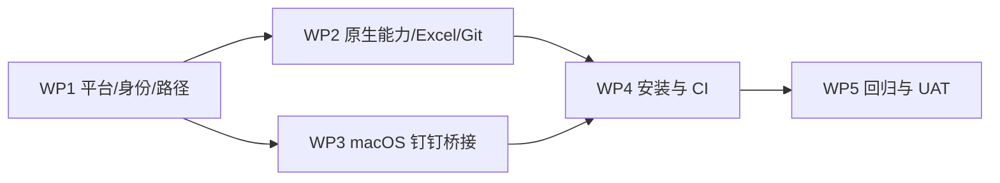

# 09 实施计划、风险与 ADR

## 1. 实施原则

按“平台内核 → 普通原生能力 → 桌面高风险能力 → 发布链路 → 全平台验收”的顺序实施。任何阶段都不能通过临时放宽路径、Shell、权限或幂等限制来换取 macOS 可用。

## 2. 工作包一：平台抽象、路径与身份迁移

### 输入

- 当前 `SessionService`、平台判断、vault router、应用配置和 Prisma schema。
- 现有 Windows 数据备份与迁移机制。

### 输出

- `PlatformCapabilityService`。
- `LocalIdentityProvider`、`DirectoryPicker`、`DesktopAutomationBridge` 端口。
- 平台默认目录与 SQLite URL helper。
- `localIdentityKey + platform` schema 迁移。
- 会话 DTO 的中立身份字段。

### 完成定义

- MAC-AC-001～006 自动化通过。
- Windows 原资料 ID、关系和凭据引用不变。
- macOS 首次启动和重启身份稳定。
- 路径测试覆盖三平台和符号链接。

### 回滚点

迁移前已验证数据库备份。若新 schema 不能被旧版本读取，回滚必须恢复备份，禁止只切换代码。

## 3. 工作包二：目录选择、Excel 入口和 Git 验证

### 依赖

工作包一的平台端口和能力 DTO。

### 输出

- macOS `osascript` 目录选择适配器。
- 平台中立目录错误和页面文案。
- 任务页 Excel 导入入口与缓存刷新。
- macOS 真实 Git 仓库测试和文件系统修复。
- Safari/Chrome 季度下载验收。

### 完成定义

- MAC-AC-007～022 通过。
- 页面没有不可达的 Excel 导入主流程。
- Git 页面范围不扩张，现有 Windows/Linux 行为无回归。

### 回滚点

目录选择器可按能力降为浏览器辅助/手工路径；Excel 入口可以关闭但后端数据不回滚；Git 修复必须保持旧测试通过。

## 4. 工作包三：macOS 钉钉桥接与权限引导

### 依赖

- 平台能力服务和桥接端口。
- 已批准的 macOS 签名身份。
- 可丢弃钉钉测试账号、模板和群。

### 输出

- Universal Bridge.app 和用户 LaunchAgent。
- v2 心跳、请求、响应、去重和崩溃恢复。
- Accessibility/Vision 适配器。
- 设置页权限卡片和周报提交前能力检查。
- fake 协议测试与真实 UAT。

### 完成定义

- MAC-AC-023～035、MAC-AC-048 通过。
- 正常提交只产生一条日志。
- unknown、崩溃恢复和重复 runId 均不二次点击。
- 桥接普通日志和诊断包秘密扫描通过。

### 回滚点

通过能力配置禁用 macOS 桌面适配器，保留复制/导出和已有 OpenAPI/机器人通道。不得回退到固定坐标自动化。

## 5. 工作包四：macOS 安装、发布与 CI

### 依赖

工作包一至三的稳定入口、协议和构建产物。

### 输出

- `scripts/macos` 用户级运维脚本。
- API 和桥接 LaunchAgent。
- Universal、签名、公证的 macOS 发布包。
- macOS Intel/Apple Silicon CI 或受控测试机门禁。
- release manifest、SBOM 和校验和扩展。

### 完成定义

- MAC-AC-036～043、MAC-AC-046 通过。
- 安装、升级、同 schema 回滚和备份回滚演练完成。
- 休眠、唤醒、登录启动和端口冲突有证据。

### 回滚点

current 指针保持上一版本，迁移失败不激活新版本。签名、公证或架构检查失败时不发布 macOS 产物。

## 6. 工作包五：跨平台回归与文档收口

### 输出

- Windows、macOS、Linux Docker 统一门禁报告。
- 完整 MAC-REQ → 设计 → MAC-AC 追踪。
- 运维手册、已知限制、故障恢复和用户授权说明。
- 企业 UAT 和风险接受记录。

### 完成定义

- MAC-AC-044～049 通过。
- Windows 和 Docker 发布门禁无回归。
- 文档链接、术语、错误码、DTO 和实现一致。
- 未完成项明确留在已知限制，不能用“基本支持”代替证据。

## 7. 依赖关系

P2 和 P3 可在 P1 完成后并行；P4 必须使用稳定协议和目录布局；P5 只在前四个工作包完成后开始正式候选验收。

## 8. ADR

### ADR-MAC-001：macOS 原生为主交付形态

- 决策：macOS 原生进程是正式主路径，Docker Desktop 保持兼容。
- 理由：本机仓库、目录窗口和钉钉桌面需要当前 GUI 用户会话。
- 后果：必须维护用户级安装、LaunchAgent、签名和两个架构。

### ADR-MAC-002：macOS 首版使用 sealed vault

- 决策：`AUTO_WORK_VAULT_BACKEND=auto` 在 macOS 解析为 sealed。
- 理由：已有实现经过认证加密和备份测试，可避免把 Keychain 迁移与桌面兼容绑在同一版本。
- 后果：主密钥属于完整备份，丢失后只能重新配置凭据；未来可新增 `keychain:` 后端。

### ADR-MAC-003：钉钉桌面统一通过桥接协议

- 决策：macOS 原生和 Docker 均通过本地目录 IPC 调用签名桥接应用。
- 理由：系统权限应绑定稳定应用身份，API 不应直接获得桌面权限。
- 后果：需要心跳、原子队列、去重和桥接版本兼容。

### ADR-MAC-004：正式桥接必须稳定签名和公证

- 决策：Developer ID、Bundle ID 和安装路径是正式发布门禁。
- 理由：降低 Gatekeeper 阻断，并保持辅助功能/屏幕录制授权稳定。
- 后果：发布流水线需要受保护的签名和公证凭据；无凭据只能产出开发包。

### ADR-MAC-005：Git 页面不随兼容项目扩容

- 决策：保留当前分支创建/删除页面，不开放后端其他写动作。
- 理由：macOS 兼容和产品能力扩展风险不同，应分别验收。
- 后果：后端动作继续测试和维护，但不可见页面不计入本次用户范围。

### ADR-MAC-006：不提供服务端任意文件打开

- 决策：季度制品通过浏览器受控下载，不新增通用 `open path` API。
- 理由：避免把本机 Web 服务扩展为任意进程启动器。
- 后果：用户从浏览器下载目录打开文件；Safari/Chrome 行为进入验收。

### ADR-MAC-007：路径比较以真实边界为准

- 决策：用 `realpath + relative`，不依赖全局小写或字符串前缀。
- 理由：macOS 卷可能大小写敏感或不敏感，符号链接也可能改变真实位置。
- 后果：需要共享路径 helper 和更完整测试。

## 9. 风险登记

| 风险                         | 概率/影响 | 预防                                        | 触发处理                                | 发布影响               |
| ---------------------------- | --------- | ------------------------------------------- | --------------------------------------- | ---------------------- |
| 钉钉 UI/Accessibility 树变化 | 高/高     | 版本探测、AX 优先、Vision fixture、真实 UAT | 标记 degraded，禁用桌面提交，更新适配器 | 阻断完整提交声明       |
| 系统权限未授权或被撤销       | 高/中     | 能力卡片、提交前复核                        | 提示授权，其他功能继续                  | 不阻断非桌面功能       |
| 签名或公证凭据不可用         | 中/高     | 受保护 release job、提前演练                | 只产开发包                              | 阻断正式 Mac 发布      |
| Intel CI/测试机不足          | 中/中     | 固定受控 Intel 测试机                       | 标注仅 arm64 候选                       | 阻断 Intel 支持声明    |
| APFS 大小写/Unicode 差异     | 中/高     | realpath/relative、两类卷测试               | 阻断越界动作并修复 helper               | Git/文件门禁阻断       |
| DPAPI 无法跨平台解密         | 必然/中   | 迁移向导和重新配置清单                      | 连接 invalid、重新录入                  | 不阻断离线数据迁移     |
| sealed 主密钥与密文同目录    | 中/中     | 权限、完整备份、高安全部署说明              | 密钥异常时凭据功能降级                  | 安全评审决定           |
| 桥接点击后崩溃               | 低/极高   | 点击前持久阶段、runId 回执                  | unknown + 人工裁决                      | unknown 测试失败则阻断 |
| 剪贴板正文残留               | 低/高     | AX 优先、逐字段清理、异常测试               | 停止提交、修复后重测                    | 秘密扫描/测试失败阻断  |
| macOS 休眠导致租约/心跳过期  | 中/中     | 唤醒重探测、租约恢复                        | 暂停调度，恢复后继续                    | 恢复测试失败阻断       |

## 10. 发布阶段门

### Gate A：平台内核可合并

- 身份迁移、路径 helper、能力端点和 Windows 回归通过。

### Gate B：普通 macOS 功能可用

- 目录选择、Excel 入口、Git 和季度下载通过自动化与浏览器验收。

### Gate C：桌面桥接候选

- 权限、协议、防重、unknown 和两架构真实 UAT 通过。

### Gate D：正式发布候选

- 签名、公证、安装、升级、回滚、SBOM 和校验和通过。

### Gate E：生产批准

- 全平台门禁、企业测试资源 UAT、安全评审和已知限制签字完成。

## 11. 通用完成定义

每个实现变更必须同时具备：

- 关联 MAC-REQ、ADR 和 MAC-AC；
- API/数据/页面/脚本设计一致；
- 正常、异常、权限、超时、幂等和恢复测试；
- 无绝对路径、凭据、正文或截图泄漏；
- Windows、macOS、Docker 受影响平台回归；
- 升级、回滚和已知限制更新；
- 用户可理解的错误与下一步动作。
